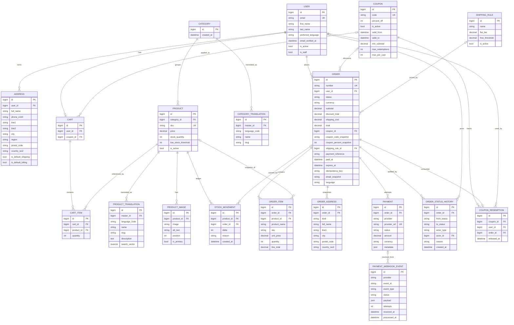
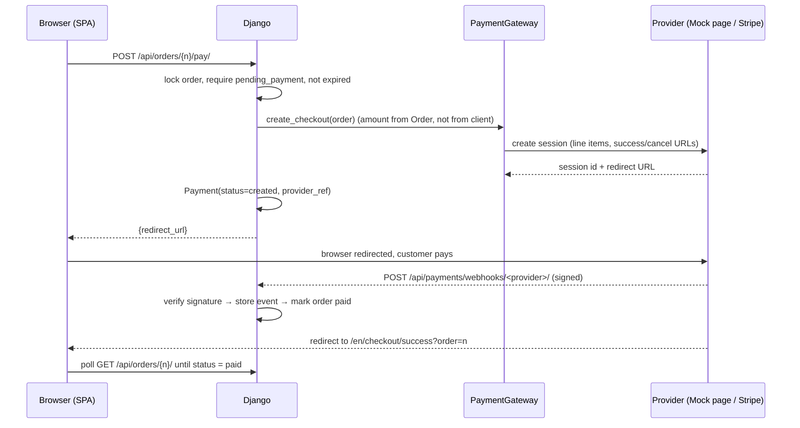
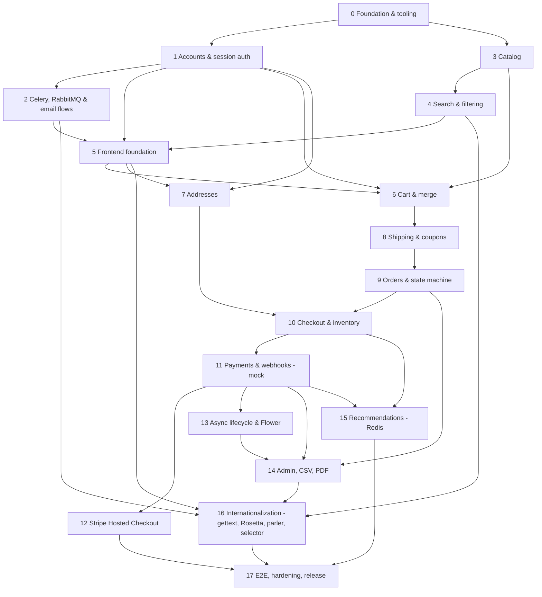

# Production-Style E-Commerce — System Design & Implementation Roadmap

**Stack:** Django · DRF · PostgreSQL · React + TypeScript · TanStack Query · Celery · RabbitMQ · Flower · Valkey/Redis · Mailpit · Docker Compose · GitHub Actions
**Baseline:** *Django 5 By Example*, chapters 8–11 (re-engineered as an API-first system). **Every chapter 8–11 feature is implemented** (RabbitMQ, Flower, Redis recommendations, Rosetta, django-parler, translated slugs + language selector, localflavor, …); where a feature is adapted, the phase says how and why.
**Already decided (respected throughout):** session-cookie auth + CSRF (no JWT) · custom User model first · session cart merged into DB cart on login · accounts required for checkout · no tax · shipping by order amount (configurable in DB) · Stripe Hosted Checkout behind a gateway abstraction · Django Admin as the back office · English-only UI in v1 with `/:lang` routing (second language fully wired in backend and tooling, disabled by a flag) · generic international addresses · modular monolith.

---

## Table of contents

1. Architecture
2. Domain model (ER diagram + modelling rules)
3. Request flows (12 flows)
4. Security flows
5. Key technology decisions (compared, not stacked)
6. API surface
7. Phase dependency graph
8. The roadmap (Phases 0–17)
9. Testing strategy
10. MUST / SHOULD / OPTIONAL / DO NOT BUILD
11. How to present the project

---

## 1. High-level architecture

### 1.1 Runtime view

```text
 ┌──────────────────────────────────────────────────────────────────────┐
 │ Browser                                                              │
 │  React + TS SPA  (React Router /:lang/..., TanStack Query)           │
 │  session cookie (HttpOnly) + csrftoken cookie (readable by JS)       │
 └──────────────┬───────────────────────────────────────────────────────┘
                │  same-origin HTTPS  (/api/* proxied; no CORS in prod)
                ▼
 ┌──────────────────────────────────────────────────────────────────────┐
 │ Reverse proxy (Vite proxy in dev · Caddy/nginx in prod)              │
 └──────────────┬───────────────────────────────────────────────────────┘
                ▼
 ┌──────────────────────────────────────────────────────────────────────┐
 │ Django (gunicorn)                                                    │
 │  ┌────────────────────────────────────────────────────────────────┐  │
 │  │ DRF layer: serializers · permissions · throttles · pagination  │  │
 │  │            filtering · OpenAPI (drf-spectacular)               │  │
 │  └───────────────────────────┬────────────────────────────────────┘  │
 │  ┌───────────────────────────▼────────────────────────────────────┐  │
 │  │ Service layer (business rules live ONLY here)                  │  │
 │  │  CartService · PricingService · CheckoutService · OrderService │  │
 │  │  (state machine) · PaymentService · InventoryService ·         │  │
 │  │  RecommendationService · InvoiceService                        │  │
 │  └───────┬────────────────────────────────────────┬───────────────┘  │
 │          │                                        │                  │
 │  Django Admin (back office)              PaymentGateway interface    │
 │  calls the SAME services                  ├─ MockPaymentGateway      │
 │                                           └─ StripePaymentGateway    │
 └──────┬──────────────────┬──────────────────────────┬─────────────────┘
        │                  │                          │
        ▼                  ▼                          ▼
 ┌─────────────┐   ┌───────────────┐          ┌───────────────────┐
 │ PostgreSQL  │   │ Valkey/Redis  │          │ Stripe (test mode)│
 │ data, locks │   │ cache         │          │  ── webhooks ──►  │
 │ sessions,   │   │ throttle ctrs │          │  /api/payments/   │
 │ FTS, trgm   │   │ recommendation│          │  webhooks/stripe/ │
 └─────────────┘   │ sorted sets   │          └───────────────────┘
                   └───────────────┘

 Django ──publish (after commit)──► RabbitMQ ──consume──► Celery worker / beat
                                      ▲  (queues, DLX)        │ SMTP
                                      └── Flower (monitoring) ▼
                                                           Mailpit (dev inbox)
 Workers also read/write PostgreSQL and Valkey (affinity index, cache).
```

### 1.2 Where each component fits

| Component | Role | Why it is here |
|---|---|---|
| **React SPA** | All customer UI, routing, client state (server-state via TanStack Query) | Required by your decisions |
| **DRF API** | Thin HTTP layer: authn/authz, validation, serialization | Keeps business logic out of views |
| **Service layer** | Pricing, checkout, state machine, payments, inventory | One implementation shared by API, Admin, Celery |
| **PostgreSQL** | Source of truth; row locks; constraints; FTS; sessions | Transactions + constraints are the core of the concurrency story |
| **Valkey/Redis** | Django cache, DRF throttle counters, recommendation sorted sets | Shared TTL cache + fast incremental counters |
| **Celery worker/beat** | Emails, order expiry sweep, low-stock alerts, recommendation updates | Work that must not block a request or must run on a schedule |
| **RabbitMQ** | Celery broker: durable queues, dead-letter exchange, publisher confirms | Reliable delivery of business-critical tasks; the book's choice |
| **Flower** | Task and queue monitoring | Visibility into retries, failures, queue depth |
| **Rosetta** | Browser editor for `.po` translation files (Translators group; off in prod) | Part of the book's i18n workflow |
| **Mailpit** | Local SMTP sink + web inbox | Verify emails without a real provider |
| **Payment gateway** | Mock (default) / Stripe (optional) | App runs with zero external dependencies |
| **Django Admin** | Catalog, orders, coupons, shipping, payments, webhook events | No second frontend to build or secure |

### 1.3 Backend layout (modular monolith)

```text
backend/
├── config/                 settings/{base,dev,test,prod}.py, urls.py, celery.py
├── common/                 money.py, exceptions.py, permissions.py, throttles.py,
│                           pagination.py, exports.py (CSV), idempotency.py
├── accounts/               User, verification, reset, auth views
├── products/               Category, Product, ProductImage, StockMovement, inventory.py, search.py (+ parler translation models from Phase 16)
├── cart/                   stores.py (Session/DB), services.py, merge.py
├── addresses/              Address, validation registry (localflavor), countries metadata
├── shipping/               ShippingRule, calculator
├── coupons/                Coupon, CouponRedemption, validation
├── orders/                 Order, OrderItem, OrderAddress, OrderStatusHistory,
│                           state_machine.py, services.py (checkout), invoices.py
├── payments/               Payment, PaymentWebhookEvent, gateways/{base,mock,stripe}.py, services.py
├── recommendations/        redis_index.py (sorted sets + Lua), selectors.py (SQL oracle), services.py, tasks.py
└── locale/                 en/, ar/ LC_MESSAGES/django.po (committed)
```

Per-app convention: `models.py · services.py (writes, rules) · selectors.py (reads) · api/{serializers,views,urls}.py · admin.py · tests/`. **Rule:** views and admin actions never contain business rules — they call services. Dependency direction: `orders → (cart, pricing, products, addresses, coupons, shipping)`, `payments → orders`; **never** the reverse (use callbacks/signals/`on_commit` hooks registered at `ready()`).

### 1.4 Frontend layout

```text
frontend/src/
├── components/     generic UI (Button, Field, Money, Spinner, ErrorBoundary)
├── layouts/        RootLayout, LangLayout (validates :lang), AccountLayout
├── pages/          thin route components that compose features
├── features/       auth/ catalog/ cart/ checkout/ orders/ addresses/ recommendations/
│                   (each: api.ts queries+mutations, components/, hooks/, schemas.ts)
├── services/       http client (fetch wrapper, CSRF, error normalisation), queryClient
├── hooks/          cross-feature hooks (useLocalizedNavigate, useDebounce)
├── contexts/       LanguageContext (only things that are NOT server state)
├── types/          api.d.ts (GENERATED from OpenAPI — never hand-edited)
└── i18n/           index.ts, languages.ts (AVAILABLE/ENABLED_LANGS), LanguageSelector, locales/{en,ar}/*.json
```

### 1.5 Docker Compose services

| Service | Image / build | Notes |
|---|---|---|
| `db` | postgres:17 | healthcheck; volume |
| `valkey` | valkey/valkey:8 | cache, throttle counters, recommendation index; `maxmemory-policy volatile-lru` (cache keys carry TTLs, index keys do not) |
| `rabbitmq` | rabbitmq:4-management | Celery broker; management UI :15672; healthcheck |
| `backend` | ./backend | `runserver` in dev, gunicorn in prod; WeasyPrint system libs (pango) installed |
| `worker` | same image | `celery -A config worker -Q default,emails,payments` |
| `beat` | same image | `celery -A config beat` |
| `frontend` | ./frontend | Vite dev server; proxies `/api` and `/media` to backend |
| `mailpit` | axllent/mailpit | SMTP 1025, UI 8025 |
| `flower` | mher/flower | task + queue monitoring (reads RabbitMQ management API); basic auth; internal network only |
| `stripe-cli` *(profile `stripe`)* | stripe/stripe-cli | forwards webhooks to backend |

---

## 2. Domain model

### 2.1 ER diagram



*Beyond your list I added `OrderAddress` (immutable address snapshots), `CouponRedemption` (race-safe usage limits) and `StockMovement` (inventory audit ledger). `CATEGORY_TRANSLATION` / `PRODUCT_TRANSLATION` are the django-parler tables and show the **target state after Phase 16** — until then, name/slug/description/search_vector are plain columns on `Category`/`Product`.*

### 2.2 Modelling rules (these are interview material)

1. **Money:** `DecimalField(max_digits=12, decimal_places=2)`, never float. One quantization helper in `common/money.py` (`ROUND_HALF_UP` to 2 dp). Serialize as **strings** in JSON. Currency is a store-wide setting (`STORE_CURRENCY`, default `USD` for Stripe test simplicity; SAR works too) and snapshotted on the order.
2. **Snapshots, not joins, for history.** `OrderItem` copies name/SKU/unit price; `OrderAddress` copies address fields; `Order` copies coupon code/percent, email, shipping fee. Product FKs are `SET_NULL`; users are `PROTECT` (anonymize, never cascade-delete, orders).
3. **Database constraints as the last line of defence** (names explicit so tests can assert them):
   - `product.stock_quantity >= 0`, `product.price >= 0`
   - `order_item.quantity > 0`, `order_item.line_total = unit_price * quantity`
   - `order.total = subtotal - discount_total + shipping_cost`, `discount_total <= subtotal`, all amounts `>= 0`
   - `order.status IN (...)`; `paid_at IS NOT NULL` for statuses `paid/processing/shipped/completed`
   - `UNIQUE (user) WHERE status = 'pending_payment'` — at most one open checkout per user
   - `UNIQUE (user, idempotency_key)`
   - `UNIQUE (provider, event_id)` on webhook events
   - `UNIQUE (cart, product)`, `CHECK quantity > 0` on cart items
   - Partial unique: one active `ShippingRule`; one primary image per product; one default address per kind per user
   - `UNIQUE (LOWER(code))` coupons, `UNIQUE (LOWER(email))` users; `CHECK percent_off BETWEEN 1 AND 100`; `CHECK valid_to > valid_from`
4. **Status changes only through `OrderService.transition()`.** The field is read-only in serializers and Admin forms.
5. **Public identifiers:** orders are addressed by a non-sequential `number` (e.g. `ORD-8F3K2A9Q`) in URLs, *and* ownership is always enforced (defence in depth). Products by `slug`.
6. **Indexes:** `Product(is_active, category, -created_at)`, `Product(price)`, GIN on `search_vector` + GIN trigram on `name` (both move to the translation table in Phase 16, one row per language), `Order(user, -created_at)`, `Order(status, expires_at)` partial where `status='pending_payment'`, `OrderItem(product_id, order_id)`, `StockMovement(product, -created_at)`.

---

## 3. Request flows

### 3.1 Registration
1. SPA ensures a CSRF cookie (`GET /api/auth/csrf/`), then `POST /api/auth/register/ {email, password, first_name…}` with `X-CSRFToken`.
2. Serializer validates email format/uniqueness (case-insensitive) and runs Django password validators.
3. `AccountService.register()` creates the inactive-for-checkout user (`email_verified_at = NULL`) inside a transaction.
4. `transaction.on_commit` → `send_verification_email.delay(user_id)`.
5. Response `201` (no password echo). The user is logged in (session created) so they can browse/cart; **checkout requires a verified email**.
6. Mailpit shows the email; link → `/en/verify-email?token=…` → SPA posts the token to `POST /api/auth/email/verify/` → `email_verified_at` set.

### 3.2 Login
1. `POST /api/auth/login/ {email, password}` (throttled per IP **and** per email).
2. `authenticate()`; generic error on failure (no "user not found" vs "wrong password" distinction).
3. **Before** calling `django.contrib.auth.login()`, read the anonymous session cart (the helper captures it into a local variable).
4. `login()` cycles the session key (prevents session fixation) and keeps session data since it was anonymous.
5. `CartService.merge_session_cart_into_user_cart(user, captured_lines)` (flow 3.4).
6. Response: user payload + `cart_merge` report (adjustments to show as a toast). SPA invalidates `['me']` and `['cart']`.

### 3.3 Anonymous cart
1. `POST /api/cart/items/ {product_id, quantity}` — no auth. CSRF still required.
2. `CartService.for_request(request)` returns the service bound to a `SessionCartStore` (anonymous) or `DbCartStore` (authenticated). Same interface: `get_lines, add, set_quantity, remove, clear`.
3. Session stores **only** `{"items": {"<product_id>": qty}, "coupon": "CODE"|null}` — no prices, no names.
4. Every response is rebuilt from the DB: current price, availability, clamped quantity, subtotal. The client's numbers are never read.

### 3.4 Cart merge (the algorithm)
```text
merge(user, session_lines):                      # one transaction.atomic()
  cart = Cart.objects.select_for_update().get_or_create(user)[0]   # serialize double-logins
  products = Product.objects.filter(id__in=…, is_active=True)      # snapshot for validation
  for each product_id in union(db_lines, session_lines):
      wanted = db_qty + session_qty                                # combine duplicates
      limit  = min(product.stock_quantity, MAX_QTY_PER_LINE)
      final  = min(wanted, limit)
      if product missing/inactive or limit == 0: drop + record "unavailable"
      elif final < wanted: record "reduced to <final>"
      upsert CartItem(final)
  coupon: keep DB cart's coupon; else adopt session coupon if still valid
  → return MergeReport(adjustments=[…])
after commit: session["cart"] cleared (view layer), so a later login cannot re-add it.
```
Known edge (documented, accepted): a crash between DB commit and session clear could double-add on the next login; quantities are still clamped by stock.

### 3.5 Checkout (summary — full algorithm in Phase 10)
`POST /api/checkout/` with `Idempotency-Key` → authenticate + verified email → open **one** `transaction.atomic()` → lock product rows (ordered by id) → validate active/stock/limits → lock coupon row & validate → `PricingService` computes subtotal/discount/shipping/total from DB prices → snapshot addresses → create `Order(pending_payment, expires_at=now+30m)` + items → conditional stock decrement + `StockMovement` → record `CouponRedemption` → write first history row → commit. Returns the order. **No payment yet.**

### 3.6 Coupon application
`POST /api/cart/coupon/ {code}` → throttled (brute-force protection) → `CouponService.validate(code, user, subtotal)` (active, window, min subtotal, global + per-user limits) → store the code on the cart (session or DB) → response is the recomputed cart with `pricing.discount`. Failures return one generic message ("This code is invalid or has expired"). The coupon is **re-validated under lock at checkout** — cart-time validation is advisory only.

### 3.7 Shipping calculation
`ShippingCalculator.quote(discounted_subtotal)` loads the single active `ShippingRule`: `free if discounted_subtotal >= free_threshold else flat_fee`; empty cart → `0`.
**Defined rule: the coupon discount is applied BEFORE the free-shipping threshold check.** The threshold is judged on what the customer actually pays for goods. (Rationale: avoids a 50%-off coupon plus free shipping eroding margin; it is also the rule customers can verify. Document it in an ADR and show it in the UI: "Spend $X more for free shipping".)

### 3.8 Payment
Sequence (mock or Stripe, identical shape):

The success redirect **never** marks anything paid. Only the verified webhook does.

### 3.9 Webhook (idempotent)
1. Read **raw** body bytes. `gateway.parse_webhook(body, headers)` verifies signature (+ timestamp tolerance) → `400` if invalid (nothing stored).
2. `atomic()`: insert `PaymentWebhookEvent(provider, event_id, …, status=received)`. On `IntegrityError` (unique `(provider, event_id)`): load the row `select_for_update()`; if `processed` → return `200 duplicate`; if `received/failed` (a previous attempt crashed) → continue and reprocess.
3. Dispatch on normalized event type; handler **locks the order row**, verifies `provider_ref`, `amount`, `currency` equal the order's, then calls `OrderService.transition(order, PAID, actor=system)`. If the order is already paid → no-op (second idempotency layer).
4. Set `processed_at`, `status=processed`; commit; side effects (email, cart clear, recommendation-index update) enqueued with `on_commit`.
5. Return `200`. Return `5xx` **only** for transient internal failures (so the provider retries); `2xx` for duplicates/ignored/unknown types; `4xx` for signature failures.

### 3.10 Order state transition
`OrderService.transition(order_id, to, actor, reason)`: `atomic()` → `select_for_update()` the order → look up `(from, to)` in the transition table → check actor permission → run side effect (restore stock, release coupon, set timestamps…) → save → append `OrderStatusHistory` → `on_commit` notifications. Invalid → `InvalidTransition` (HTTP 409 / Admin error message).

### 3.11 Email notification
Business event (e.g. order paid) → inside the transaction: `on_commit(lambda: send_order_confirmation.delay(order_id))` → message goes to the RabbitMQ `emails` queue → worker consumes it, loads the order by id, renders HTML+text templates (gettext-wrapped), sends via SMTP (Mailpit in dev), guarded by `Order.confirmation_sent_at` conditional update so retries cannot double-send → failure triggers retry with exponential backoff + jitter.

### 3.12 PDF invoice
`GET /api/orders/{number}/invoice/` → permission: owner or staff with perm → order must be `paid` or later → `InvoiceService.render(order)` builds HTML from the **snapshot** fields only → WeasyPrint with a restricted `url_fetcher` (no network/file access) → `200 application/pdf`, `Content-Disposition: attachment`, `Cache-Control: private, no-store`. Admin has the same via a custom admin view.

### 3.13 Recommendation index update and read
1. Order transitions to `paid` → `on_commit` → `update_affinity.delay(order_id)` (queue `default`).
2. Task loads the order's distinct product ids (capped at 30 to bound the O(n²) pair count).
3. A single Lua script runs atomically in Valkey: `SETBIT reco:indexed order_id` → only if the previous bit was `0`, `ZINCRBY reco:<v>:also:A 1 B` and `ZINCRBY reco:<v>:also:B 1 A` for every pair. Retries and duplicate events cannot double count.
4. Read (`GET products/{slug}/recommendations/`): `ZREVRANGE` → drop scores below `MIN_SUPPORT` → hydrate the products from PostgreSQL in one query (active, in stock) → keep Redis order. Cart (`GET cart/recommendations/`): `ZUNIONSTORE tmp:<uuid>` over the cart items' keys, `ZREVRANGE`, remove items already in the cart, `EXPIRE tmp 60`.
5. Nightly: rebuild from SQL into `reco:<new_version>:*`, then `SET reco:active_version <new_version>` (atomic switch); old version deleted later.

### 3.14 Language switching
1. The selector is rendered only if more than one language is enabled.
2. SPA builds the new URL: same route, new `:lang`. For product/category pages it uses `translations[newLang].slug` from the last API response (if absent: fetch by current slug and follow the returned canonical slug).
3. SPA sets the i18next language, `<html lang dir>`, lazily loads the namespaces. Query keys contain the language so caches never mix.
4. Requests send `Accept-Language: <lang>`.
5. Backend picks the language: `?lang=` > `Accept-Language` > `User.preferred_language` > default (only among `LANGUAGES`); parler resolves content with fallback to `en`; gettext translates messages.
6. If logged in, `PATCH profile/ {preferred_language}` so emails and invoices use it.
7. Unknown or disabled prefixes (`/xx/...`, or `/ar/...` while disabled) → redirect to `/en`.

---

## 4. Security flows

### 4.1 Session authentication + CSRF with React
- **Session cookie:** `HttpOnly`, `Secure` (prod), `SameSite=Lax`. JS cannot read it → XSS cannot exfiltrate the session token directly.
- **CSRF cookie:** `csrftoken`, `Secure`, `SameSite=Lax`, **readable** by JS (`CSRF_COOKIE_HTTPONLY=False` — necessary so the SPA can echo it).
- **Boot:** SPA calls `GET /api/auth/csrf/` (`@ensure_csrf_cookie`). Fetch wrapper adds `X-CSRFToken` header on every non-safe method and uses `credentials: 'include'`.
- **Server:** DRF `SessionAuthentication` enforces CSRF on authenticated requests; for anonymous cart writes we also apply Django's CSRF check (custom `CsrfEnforcedAnonymous` mixin) because the session cart is cookie-bound.
- **Why it works:** a cross-site attacker page can make the browser *send* cookies but cannot *read* `csrftoken` (same-origin policy) and so cannot supply a matching header. `SameSite=Lax` is a second layer.
- **Deployment shape:** serve SPA and API from the **same origin** (proxy `/api`). Then no CORS config is needed. If you must go cross-origin: `CORS_ALLOWED_ORIGINS` explicit list (never `*`), `CORS_ALLOW_CREDENTIALS=True`, `CSRF_TRUSTED_ORIGINS` set, same registrable domain for `SameSite`.
- **Session fixation:** `login()` cycles key. **Logout:** `flush()`. **Password change:** `update_session_auth_hash` for the current session; others are invalidated automatically.

### 4.2 Authorization
Three layers: (1) DRF `permission_classes` (authenticated / verified / staff); (2) **queryset scoping** (`Order.objects.filter(user=request.user)`) so other users' objects simply don't exist → `404`; (3) an explicit `IsOwner` object permission as backup. A shared test helper asserts, for **every** user-scoped endpoint, that user B gets `404` on user A's object.

### 4.3 Webhook verification
Signature over **raw bytes** (HMAC-SHA256 with timestamp for the mock; `stripe.Webhook.construct_event` for Stripe), timestamp tolerance (replay window), secret from env, constant-time compare, endpoint is `csrf_exempt` + unauthenticated + **not** throttled (providers retry), body size limit. Verified ≠ trusted blindly: amount, currency, and reference are re-checked against our order.

### 4.4 Payment flow security
Amounts originate only from `Order` rows. Provider secret keys exist only in backend env. The browser only receives a redirect URL. The order becomes paid only from a verified event. Stripe-side idempotency keys prevent duplicate sessions. Mock gateway endpoints exist only when `PAYMENT_GATEWAY=mock` **and** (`DEBUG` or `ALLOW_MOCK_GATEWAY=true`).

### 4.5 Stock locking
Covered in depth in Phase 10 and §5.6: `select_for_update()` on product rows in id order inside `atomic()`, plus a conditional `UPDATE … WHERE stock >= qty` and a `CHECK (stock >= 0)` as independent safety nets.

### 4.6 Control → threat table (use as `docs/threat-model.md`)

| Control | Threat it stops |
|---|---|
| Session cookie `HttpOnly`/`Secure`/`SameSite` | Token theft via XSS; sniffing; basic CSRF |
| CSRF token header | Cross-site forged state-changing requests |
| Session key cycling on login | Session fixation |
| Argon2 hashing + password validators | Offline cracking after DB leak; weak passwords |
| Login/reset/register throttling (IP + email) | Credential stuffing, brute force, email bombing |
| Generic auth/reset/coupon errors | Account & coupon enumeration |
| Reset links built from `FRONTEND_URL`, not `Host` | Host-header poisoning of reset emails |
| Signed, expiring verification/reset tokens | Token forgery/replay |
| Queryset scoping + `IsOwner` + 404 | IDOR / broken object-level authorization |
| Server-side pricing | Price/total tampering |
| `select_for_update` + conditional update + CHECK | Overselling via race condition |
| Idempotency-Key on checkout | Duplicate orders from double-click/retry |
| Unique `(provider,event_id)` + state guards | Webhook replay / double-processing |
| Webhook signature + amount check | Forged "payment succeeded" calls |
| Upload validation (Pillow verify, size, dims, allowlist, UUID names) | Malicious uploads, decompression bombs, path tricks |
| ORM only; no string-built SQL; ordering/filter whitelists | SQL injection |
| React escaping; no `dangerouslySetInnerHTML`; CSP | XSS |
| `next` redirect param must be relative path | Open redirect after login |
| Restricted WeasyPrint `url_fetcher` | SSRF / local-file read via invoice HTML |
| CSV cell sanitization | CSV/formula injection when staff open exports |
| Admin: non-default URL, groups, perms, no deletes, optional 2FA | Admin takeover / insider misuse |
| Env-based secrets, `.env` git-ignored, gitleaks pre-commit | Secret leakage |
| RabbitMQ UI / Flower / Rosetta / Valkey never public; Valkey ACL user; Rosetta off in prod | Task tampering, info disclosure, translation/template injection, cache poisoning |
| `check --deploy`, HSTS, security headers, `pip-audit`/`npm audit` | Misconfiguration, vulnerable dependencies |

---

## 5. Key technology decisions

### 5.1 Why sessions, not JWT
Same-origin SPA + one backend → cookies are the simpler, safer fit: server-side revocation (logout/password change really log you out), `HttpOnly` storage (no token in `localStorage`), built-in CSRF + session fixation protections, and it makes the **anonymous session cart** natural (the same session identifies both anonymous and logged-in browsers). JWT's advantages (stateless, multi-service, mobile clients) are not requirements here, and its costs (revocation, refresh-token rotation, storage choice) are real.

### 5.2 Celery broker: RabbitMQ vs Valkey/Redis — **RabbitMQ is the broker**

| | RabbitMQ | Valkey/Redis |
|---|---|---|
| Delivery semantics | Durable queues, per-message acks, publisher confirms, dead-letter exchanges (DLX), routing | Lists + visibility timeout; weaker durability defaults; no native dead-lettering |
| Operations | Extra service, but a management UI (queue depth, consumers, DLQ inspection) | Already running for cache/throttle/index |
| Fit for this workload | Order expiry, webhook follow-ups and emails are business-critical *and* idempotent — DLQ + replay is a real operational tool | Adequate for the volume, fewer failure-handling primitives |

**Decision:** RabbitMQ is the Celery broker (the book's choice, and it teaches AMQP concepts you cannot learn from Redis). Valkey stays in the stack for **different jobs** — Django cache, DRF throttle counters, and the recommendation index (§5.3) — so neither service duplicates the other.

*Honest note for interviews:* at this traffic Valkey-as-broker would also work. What RabbitMQ buys here is demonstrable reliability engineering: durable queues, publisher confirms, dead-letter queues with a replay command, and queue-depth monitoring in Flower.

**Safety rule (architecture principle):** PostgreSQL is the source of truth; broker messages are *triggers*. Every task re-checks state, and sweeps (e.g. order expiry) rediscover work from the database — so a lost or duplicated message can never corrupt an order.

**What RabbitMQ demonstrates in this project:** exchanges/queues/bindings (`default`, `emails`, `payments`), a dead-letter exchange + queue, publisher confirms, `acks_late` + `reject_on_worker_lost`, the management UI, and Flower's queue statistics (Phase 13).

### 5.3 Recommendations: Redis sorted-set index (as in the book), hardened

**Implemented as in the book:** every time an order is paid, each pair of products in it gets `ZINCRBY` in both directions; reading recommendations is a `ZREVRANGE`; recommendations for a whole cart use `ZUNIONSTORE` into a short-lived temp key.

**Why Redis is a good fit:** incremental O(log N) updates with no scan of order history; very fast reads; `ZUNIONSTORE` makes "recommend for the whole cart" a single command.

**The cost, and how this design handles it** (the dual-write problem — the index is a second copy of facts that live in PostgreSQL):

| Risk | Mitigation |
|---|---|
| Double counting on task retries / duplicate events | One **Lua script** per order: `SETBIT reco:indexed <order_id>` returns the previous bit; pairs are incremented **only if the bit was 0** → exactly once per order, atomically |
| Index drifts from PostgreSQL (crash between commit and update, refunds, bugs) | **Nightly reconciliation**: rebuild the full index from SQL into versioned keys, then atomically switch a pointer key (`reco:active_version`) |
| Valkey data loss or restart | Same rebuild command restores everything (index is *derived data*) |
| Cache eviction deleting the index | `maxmemory-policy volatile-lru`: all cache/throttle keys carry TTLs, index keys carry none |
| Valkey down at request time | Circuit breaker → fall back to the SQL query (also the benchmark baseline) |

**PostgreSQL stays in the design as the oracle:** the SQL co-purchase query is used (a) to rebuild/reconcile, (b) as the fallback, and (c) as the **test oracle** — a test asserts that the Redis result equals the SQL result for randomized order sets. Result: you get the book's Redis technique *and* demonstrate how to keep a derived index trustworthy.

### 5.4 Search: PostgreSQL only
Full-text (`SearchVector` weights, `websearch` queries, GIN) for relevance + `pg_trgm` for typo tolerance and prefix-ish matching. Elasticsearch is justified by millions of documents, faceting at scale, or advanced relevance tuning — none apply, and it adds sync/consistency problems. **Do not build.**

### 5.5 Internationalization — every book tool is used, each with a clear job

| Tool | What it does here | Phase |
|---|---|---|
| **react-i18next** | All UI strings, plurals, lazy-loaded namespaces; `Intl` formatting for money/dates | 5, 16 |
| **Django gettext** | Backend-generated text: emails, validation messages, invoices, admin; `.po`/`.mo` translation files via `makemessages`/`compilemessages` | 16 |
| **django-parler** | Translated **database content**: `Category` and `Product` name, description and **slug** per language | 16 |
| **Rosetta** | Browser UI for editing the `.po` files (restricted to a `Translators` group; off in production by default) | 16 |
| **django-localflavor** | Country-specific address validation | 7 |
| **Language selector** | React component that switches the `/:lang` prefix and swaps translated slugs | 5, 16 |
| **Translated URL patterns** | Language prefix handled by **React Router**; translated **slugs** via parler; Django `i18n_patterns` only for Django-rendered URLs (admin, Rosetta) — the API stays language-neutral and reads `Accept-Language` | 16 |

**Release policy:** the backend is built with `LANGUAGES = en, ar` and the full toolchain works end-to-end, but the **UI ships English-only**: `ENABLED_LANGS=['en']` is a frontend flag, any other prefix redirects to `/en`, and **no RTL layout/styling is built** (only `dir` is set and logical CSS properties are used so RTL is cheap later).

**Why parler is introduced late (Phase 16) on purpose:** it mirrors the book and teaches a real-world skill — retrofitting translation tables onto live data (schema migration + data migration + search rework). Phase 3 prepares for it by isolating translatable text behind serializers/selectors, so the retrofit touches one layer.

### 5.6 Why `select_for_update()` (and where)
**Problem (read-check-write race):** under PostgreSQL's default `READ COMMITTED`, two transactions can both read `stock=1`, both pass `if stock >= 1`, both write `stock=0` → two orders for one unit.
**Fix:** `Product.objects.select_for_update().filter(id__in=ids).order_by('id')` inside `transaction.atomic()`. The second transaction **blocks** at the lock until the first commits, then re-reads the committed row (`stock=0`) and fails cleanly with `OutOfStock`.
**Where used:** (1) product rows during checkout and during stock restoration; (2) coupon row during checkout (usage limits); (3) order row in every transition and webhook handler (serializes payment vs expiry vs cancel); (4) cart row during merge; (5) order rows with `skip_locked=True` in the expiry sweep so parallel workers don't collide.
**Deadlock avoidance:** always lock in a consistent order (`order_by('id')`); keep transactions short; set `lock_timeout`.
**Defence in depth:** a conditional `UPDATE … SET stock = stock - q WHERE stock >= q` (rowcount must be 1) and the `CHECK (stock >= 0)` constraint.
**Alternatives considered:** atomic conditional update only (correct and cheaper, but no clean multi-line validation); optimistic version column (retries under contention); `SERIALIZABLE` (correct, needs retry loops). We use lock + conditional update because the checkout must validate *several* products and a coupon as one unit.

### 5.7 Stock reservation model
Stock is **decremented when the order is created** (reservation), restored if the order is cancelled/expired. A 30-minute TTL bounds how long a pending order can hold stock. The cart itself never reserves stock. (Alternative — decrement on payment — risks charging for items that vanished; rejected.)

---

## 6. API surface

Base `/api/`, JSON, session auth, CSRF on unsafe methods, pagination `{count,next,previous,results}`, errors in one shape `{code, detail, fields?}`, schema at `/api/schema/`, docs at `/api/docs/`.

| Area | Endpoints |
|---|---|
| **Auth** | `GET auth/csrf/` · `POST auth/register/` · `POST auth/login/` · `POST auth/logout/` · `GET auth/me/` · `POST auth/change-password/` · `POST auth/password-reset/` · `POST auth/password-reset/confirm/` · `POST auth/email/verify/` · `POST auth/email/resend/` |
| **Profile** | `GET/PATCH profile/` (incl. `preferred_language`) |
| **i18n** | `GET i18n/languages/` → `{default, enabled, available}`; language chosen via `?lang=` > `Accept-Language` > user preference; product/category payloads include `translations` (alternate slugs) from Phase 16 |
| **Catalog** | `GET categories/` · `GET categories/{slug}/` · `GET products/?search=&category=&min_price=&max_price=&in_stock=&ordering=&page=` · `GET products/{slug}/` |
| **Recommendations** | `GET products/{slug}/recommendations/` · `GET cart/recommendations/` |
| **Cart** | `GET cart/` · `POST cart/items/` · `PATCH cart/items/{product_id}/` · `DELETE cart/items/{product_id}/` · `DELETE cart/` · `POST cart/coupon/` · `DELETE cart/coupon/` |
| **Shipping** | `GET shipping/rules/` (public: threshold/fee for the banner) |
| **Addresses** | `GET/POST addresses/` · `GET/PATCH/DELETE addresses/{id}/` · `POST addresses/{id}/set-default/` · `GET countries/` (per-country field metadata) |
| **Checkout** | `POST checkout/preview/` · `POST checkout/` (`Idempotency-Key`) |
| **Orders** | `GET orders/` · `GET orders/{number}/` · `POST orders/{number}/cancel/` · `POST orders/{number}/pay/` · `GET orders/{number}/invoice/` |
| **Payments** | `POST payments/webhooks/{provider}/` (public, signed) · *dev only:* `POST dev/mock-payments/{ref}/simulate/` |

**TypeScript contract sync:** `drf-spectacular` generates `schema.yml` (`manage.py spectacular --file schema.yml --validate --fail-on-warn`). Frontend runs `openapi-typescript schema.yml -o src/types/api.d.ts` (optionally `openapi-fetch` for a typed client). CI regenerates both and **fails if `git diff` is non-empty** — so an API change that isn't reflected in committed types breaks the build. Use `@extend_schema` on every view so the schema is accurate (request/response/errors).

---

## 7. Phase dependency graph



**Parallelizable:** 3–4 can run alongside 1–2. 7 (addresses) can run alongside 6/8. 15 can start after 11. Frontend work for each backend phase is done in the **same phase** (vertical slices), after the Phase 5 foundation. Phase 16 (i18n) touches catalog, search, API, emails and invoices, so run it after Phase 14/15 and before final hardening.

---

## 8. The roadmap

Each phase is a **vertical slice**: backend + frontend + tests + docs ship together. Tests are written *in* the phase, not after.

---

### Phase 0 — Foundation & Tooling  *(foundational)*

**Goal:** A reproducible environment, a green CI pipeline, and the custom User model in place before anything else.
**Why this phase exists:** `AUTH_USER_MODEL` cannot be changed painlessly after migrations that reference users. Reproducible tooling means every later phase is verifiable from day one.
**Dependencies:** none.
**Concepts you will learn:** Twelve-factor config, settings layering, custom user models, Docker Compose networking/healthchecks, pre-commit, CI basics, ADRs.

**Backend tasks**
- Create `backend/config` with settings split `base/dev/test/prod` using `django-environ`; production settings fail fast on missing secrets.
- Create empty app skeletons per §1.3 (only `accounts` has models).
- `accounts.User`: `AbstractBaseUser + PermissionsMixin`, `USERNAME_FIELD='email'`, custom `UserManager`, fields `first_name`, `last_name`, `preferred_language` (default `en`), `email_verified_at`. **Generate `0001_initial` before any `migrate`.**
- `common/money.py` (quantize helper), `common/exceptions.py` (domain exceptions), DRF exception handler → uniform error shape.
- `GET /api/health/` (checks DB).
- Structured logging config (JSON in prod, request id).

**Frontend tasks**
- Vite + React + TypeScript (`strict: true`), ESLint, Prettier, Vitest + RTL setup with one smoke test.

**Database tasks**
- Postgres container with volume + healthcheck; naming convention for constraints/indexes; `UNIQUE (LOWER(email))` constraint on User.

**API tasks**
- Install `drf-spectacular`; serve `/api/schema/` and `/api/docs/`.

**Security tasks**
- `.env.example`, `.env` git-ignored; `gitleaks` in pre-commit; prod settings with `DEBUG=False`, `ALLOWED_HOSTS` from env; `manage.py check --deploy` wired into CI (warnings reviewed).

**Testing tasks**
- pytest + pytest-django + factory_boy configured; `UserFactory`; tests: user manager creates users, email uniqueness is case-insensitive, health endpoint works. Vitest smoke test.

**Documentation tasks**
- README (how to run), `docs/adr/0001-modular-monolith.md`, `0002-session-auth.md`, `0003-rabbitmq-broker-valkey-cache.md`, ADR template.

**Exact deliverable:** `docker compose up` brings up db, valkey, rabbitmq, backend, frontend, mailpit (worker/beat arrive in Phase 2, Flower in Phase 13); `/api/docs/` loads; GitHub Actions runs Ruff + pytest + ESLint + `tsc` + Vitest + build, all green.
**Definition of Done**
- [ ] Fresh clone → running stack in ≤ 3 commands
- [ ] CI green on a PR; pre-commit hooks installed
- [ ] Custom user migration is `0001`, committed before any other migration
- [ ] ADRs 1–3 written

**Do NOT implement yet:** any business models, Celery, auth endpoints, Stripe, i18n.

**CV bullet:** *"Bootstrapped a containerized Django/DRF + React/TypeScript monorepo with a custom email-based user model, Docker Compose environment, pre-commit linting (Ruff, ESLint), and GitHub Actions CI running tests, type checks and builds."*
**Interview topics:** Why a custom User model from day one? Why split settings and how do you manage secrets? Why a modular monolith over microservices? What does `check --deploy` verify? What does a healthcheck in Compose buy you?

---

### Phase 1 — Accounts & Session Authentication  *(foundational)*

**Goal:** Secure, throttled, session-cookie auth API with object-level authorization patterns established.
**Why this phase exists:** Cart merging, orders, addresses and payments all rely on correct authentication and ownership rules; setting the patterns now avoids IDOR bugs later.
**Dependencies:** Phase 0.
**Concepts you will learn:** Django sessions, CSRF mechanics, session fixation, password hashing, DRF auth/permissions/throttling, object-level authorization, enumeration resistance.

**Backend tasks**
- `AccountService.register / login / logout / change_password`.
- Password hashers: Argon2 first (`argon2-cffi`); validators: min length 10, common-password, similarity, numeric-only.
- Session settings: `SESSION_COOKIE_HTTPONLY`, `SAMESITE='Lax'`, `SECURE` in prod, bounded `SESSION_COOKIE_AGE`; DB-backed sessions.
- `GET /api/auth/csrf/` using `ensure_csrf_cookie`.
- Hook point: a `post_login` callback registry (used by Phase 6 for the cart merge) — do **not** import cart code into accounts.
- `GET/PATCH /api/profile/` (name, phone).
- `common/permissions.py`: `IsOwner`, `IsVerifiedUser` (used later), and a queryset-scoping mixin.

**Frontend tasks**
- None beyond Swagger UI / `httpie` verification (React auth pages arrive in Phase 5 with the shared client).

**Database tasks**
- Verify indexes for lookup by email; session table cleanup via `clearsessions` (scheduled in Phase 13).

**API tasks**
- Endpoints: csrf, register, login, logout, me, change-password, profile. `@extend_schema` on all. Uniform error shape. `me` returns `{id, email, first_name, email_verified, is_staff}`.

**Security tasks**
- DRF throttle scopes: `login` (5/min/IP **and** a per-email counter), `register` (10/hour/IP), `password_change`. Cache-backed (Valkey once present; locmem in tests).
- Generic login failure message; constant-time-ish behaviour (run the hasher even for unknown emails).
- Session key cycled on login; `flush` on logout.
- Do not expose `is_superuser`/permissions in API.

**Testing tasks**
- Register/login/logout/me happy paths; wrong password; throttling triggers `429`; CSRF missing → `403`; session cookie flags asserted; `change_password` keeps current session but old password invalid; email case-insensitivity; **reusable `assert_object_isolated()` helper** that proves user B gets `404` on user A's resource (used in all later phases); password-validator tests.

**Documentation tasks**
- `docs/auth.md`: cookie/CSRF diagram, throttle table, decision record why not JWT.

**Exact deliverable:** Working auth API, documented in Swagger, fully tested.
**Definition of Done**
- [ ] All auth endpoints pass tests including throttling and CSRF
- [ ] Cookie attributes verified in tests for prod settings
- [ ] `IsOwner` + scoping helper + isolation test helper exist and are documented
- [ ] No endpoint reveals whether an email exists on login

**Do NOT implement yet:** email verification/reset (needs Celery), React pages, 2FA, social login.

**CV bullet:** *"Implemented Django session-cookie authentication for a React SPA with CSRF protection, Argon2 password hashing, IP- and account-scoped throttling, and reusable object-level authorization tests."*
**Interview topics:** Why session cookies instead of JWT? How does CSRF protection work with a SPA? What is session fixation and how does Django prevent it? How do you prevent user enumeration? Why return 404 instead of 403 for others' objects? What does `SameSite=Lax` do?

---

### Phase 2 — Celery, RabbitMQ & Email Flows  *(foundational → intermediate)*

**Goal:** Reliable background tasks and email verification, password reset.
**Why this phase exists:** Introduces the async pattern (`on_commit` + idempotent tasks) before it is needed for orders; email flows are a safe place to learn retries.
**Dependencies:** Phase 1.
**Concepts you will learn:** Celery architecture, AMQP exchanges/queues/bindings, dead-letter queues, publisher confirms, `acks_late`, retries/backoff, task idempotency, `transaction.on_commit`, signed tokens, Mailpit.

**Backend tasks**
- `config/celery.py`; **RabbitMQ** as broker (`amqp://`), results disabled by default (tasks record outcomes in the DB); Django cache and throttle counters on Valkey.
- Settings: `task_acks_late=True`, `task_reject_on_worker_lost=True`, `worker_prefetch_multiplier=1`, time limits, `autoretry_for`, `retry_backoff`, `retry_jitter`; **durable queues** `default`, `emails`, `payments` declared with kombu `Queue`/`Exchange`; a **dead-letter exchange + `dead_letter` queue** for messages rejected after retries; `broker_transport_options={'confirm_publish': True}` (publisher confirms).
- Tasks: `send_verification_email(user_id)`, `send_password_reset_email(user_id)` — **pass IDs, not objects**; load fresh inside the task.
- Tokens: email verification via `TimestampSigner` (salted, max-age 3 days). Password reset via `default_token_generator`; token string sent to SPA as `"<uidb64>.<token>"` so the single `:token` route param carries both.
- Endpoints: `POST auth/email/verify/`, `POST auth/email/resend/` (throttled), `POST auth/password-reset/` (always `202`), `POST auth/password-reset/confirm/`.
- Email templates: HTML + text, gettext-wrapped; links built from `settings.FRONTEND_URL` (**never** from the request `Host`).
- `IsVerifiedUser` permission now enforceable.
- Beat service container added (empty schedule).

**Frontend tasks**
- None (pages in Phase 5), but document the exact link formats the SPA must handle.

**Database tasks**
- `User.email_verified_at` populated; no new tables.

**API tasks**
- Four endpoints above with schema docs; consistent error codes (`token_invalid`, `token_expired`).

**Security tasks**
- Reset request returns identical response whether or not the email exists; throttle per IP and per email; reset invalidates existing sessions (password hash change does this); tokens are single-use by construction (hash of password/last_login); verification tokens not reusable to change email.

**Testing tasks**
- Tasks run eagerly in unit tests and assert `mail.outbox`; expired/tampered token tests; reset flow end-to-end; `on_commit` behaviour verified (`django_capture_on_commit_callbacks`); retry test (SMTP raises once, second attempt succeeds); host-header-poisoning test (link still uses `FRONTEND_URL`); an integration test against real RabbitMQ + a worker (CI service) proving publish → consume, and that a poisoned message lands in the dead-letter queue.

**Documentation tasks**
- `docs/async.md`: why `on_commit`, why IDs not objects, retry + dead-letter policy, RabbitMQ vs Valkey-as-broker comparison, RabbitMQ management UI walkthrough.

**Exact deliverable:** Register → verification email appears in Mailpit → link verifies; forgot password → reset email → password changes.
**Definition of Done**
- [ ] Worker + beat run in Compose; queues and the dead-letter queue visible in the RabbitMQ UI
- [ ] All four email endpoints tested incl. failures
- [ ] No task is enqueued before its transaction commits

**Do NOT implement yet:** order emails, periodic tasks, Flower (Phase 13).

**CV bullet:** *"Built asynchronous email verification and password-reset flows with Celery and RabbitMQ (durable queues, dead-letter handling, transaction-safe enqueueing, retries with exponential backoff, signed expiring tokens) and verified them with Mailpit."*
**Interview topics:** Why Celery? Why `transaction.on_commit` for enqueueing? Why pass IDs to tasks? RabbitMQ vs Redis/Valkey as a broker — which did you choose and why? What is a dead-letter queue? What makes a task idempotent? How do you stop password-reset enumeration and host-header attacks?

---

### Phase 3 — Catalog  *(foundational)*

**Goal:** Categories, products, images and stock managed in Django Admin and served read-only over the API.
**Why this phase exists:** Everything commercial references products; its constraints (price, stock) underpin later invariants.
**Dependencies:** Phase 0.
**Concepts you will learn:** Modelling with constraints, indexes, `ImageField` security, N+1 queries, admin customization basics.

**Backend tasks**
- Models: `Category(name, slug)`, `Product(category, sku, slug, name, description, price, stock_quantity, low_stock_threshold, is_active, timestamps)`, `ProductImage(product, image, alt_text, position, is_primary)`.
- `Product.is_available` = active and `stock_quantity > 0`.
- **Design for Phase 16:** read `name`/`description`/`slug` only through serializers and `selectors.py`, and keep search code in `products/search.py`, so moving those columns into django-parler translation tables later changes one layer, not the whole app.
- Slug auto-generation + uniqueness; `seed_products` management command (Faker) for demos/perf tests.
- Image validation: size ≤ 5 MB, allow JPEG/PNG/WebP only, `Pillow.verify()`, max pixel dimensions, UUID filenames, **no SVG**.

**Frontend tasks**
- None yet (Phase 5), except agreeing on the product JSON shape via the OpenAPI schema.

**Database tasks**
- CHECK constraints (`price >= 0`, `stock_quantity >= 0`); partial unique primary image; indexes per §2.2; migrations reviewed by hand.

**API tasks**
- `GET categories/`, `GET products/`, `GET products/{slug}/` — public, read-only, active-only; `select_related('category')`, `prefetch_related('images')`; price as string; expose `in_stock` + `stock_status` (`in_stock/low_stock/out_of_stock`) rather than raw internal quantities.

**Security tasks**
- Inactive products invisible through every public path; upload validators; media served read-only; admin permissions for catalog group.

**Testing tasks**
- Factories; constraint tests (`IntegrityError`); API excludes inactive; `assertNumQueries` on list/detail (no N+1); image validator rejects fake extension, oversized, huge-dimension files; slug uniqueness.

**Documentation tasks**
- Update ER diagram; `docs/catalog.md` (stock semantics: stock is reserved at order creation).

**Exact deliverable:** Manage catalog in Admin; browse JSON via Swagger.
**Definition of Done**
- [ ] 1k seeded products list in < 100 ms (local), constant query count
- [ ] Constraints enforced at DB level and tested
- [ ] Upload validators tested

**Do NOT implement yet:** search/filtering (Phase 4), variants/attributes, reviews, wishlists.

**CV bullet:** *"Designed a PostgreSQL-backed product catalog with Decimal pricing, database CHECK constraints, partial unique indexes, validated image uploads and N+1-free DRF endpoints."*
**Interview topics:** Why Decimal over float? Why DB constraints when you validate in Python? How do you detect/avoid N+1 queries? How do you secure image uploads? Why expose `in_stock` rather than exact stock?

---

### Phase 4 — Search & Filtering  *(intermediate)*

**Goal:** Fast, relevant, filterable, paginated product search using only PostgreSQL.
**Why this phase exists:** Demonstrates real PostgreSQL capability and API design for list endpoints; avoids an unjustified Elasticsearch dependency.
**Dependencies:** Phase 3.
**Concepts you will learn:** `tsvector`/GIN, weighted ranking, `websearch_to_tsquery`, `pg_trgm`, `EXPLAIN ANALYZE`, filter/pagination/ordering design.

**Backend tasks**
- `search_vector` (`SearchVectorField`) with weights (name A, description B, category C) kept current by a PostgreSQL trigger created in a `RunSQL` migration (or recomputed in `save()`/admin bulk action).
- Query: `SearchQuery(search_type='websearch')` + `SearchRank`; fallback to trigram `similarity` on `name` when FTS returns nothing (typos).
- `django-filter` `FilterSet`: `category` (slug), `min_price`, `max_price`, `in_stock`; ordering whitelist: `relevance`, `price`, `-price`, `newest`.
- Pagination: `PageNumberPagination`, default 24, max 100.
- Migration enabling `pg_trgm` extension (`TrigramExtension`).

**Frontend tasks**
- None yet (UI in Phase 5); document query param contract.

**Database tasks**
- GIN index on `search_vector`; GIN `gin_trgm_ops` on `name`; verify with `EXPLAIN ANALYZE` on 10k–100k seeded products; record findings.

**API tasks**
- `GET products/?search=&category=&min_price=&max_price=&in_stock=&ordering=&page=&page_size=` documented in OpenAPI with parameter descriptions.

**Security tasks**
- Max search length (e.g. 100 chars), numeric bounds, whitelisted ordering, `page_size` capped; no raw SQL interpolation; throttle anonymous search (`anon` scope).

**Testing tasks**
- Relevance ordering (name match beats description match); typo tolerance; filters in combination; pagination edges (last page, out-of-range → `404`/empty per policy); ordering whitelist rejects unknown values; SQL-injection-style input is harmless; test that the index is used (assert plan contains the index on a larger seed — marked `slow`).

**Documentation tasks**
- `docs/search.md`: why PostgreSQL not Elasticsearch, with EXPLAIN screenshots/notes.

**Exact deliverable:** Search + filter + sort + paginate endpoint with measured performance.
**Definition of Done**
- [ ] 100k-product query p95 < 100 ms locally with indexes (documented)
- [ ] All filters/ordering validated and tested
- [ ] Decision doc written

**Do NOT implement yet:** autocomplete (OPTIONAL later), facets/aggregations, synonyms, Elasticsearch, per-language search configs (Phase 16).

**CV bullet:** *"Implemented product search with PostgreSQL full-text search (weighted tsvector + GIN) and pg_trgm typo tolerance, with filtering, ordering and pagination; validated query plans with EXPLAIN ANALYZE on 100k rows."*
**Interview topics:** Why PostgreSQL FTS instead of Elasticsearch? What is a GIN index? What does trigram similarity add? How do you keep `search_vector` in sync? Offset vs cursor pagination tradeoffs?

---

### Phase 5 — Frontend Foundation: Routing, API Client, Auth UI, Catalog UI  *(foundational → intermediate)*

**Goal:** A typed React app with language-prefixed routes, a CSRF-aware API client, auth pages and catalog browsing.
**Why this phase exists:** All later features are vertical slices on this foundation; the typed contract and routing structure must be right once.
**Dependencies:** Phases 1, 2, 3, 4.
**Concepts you will learn:** React Router layout routes, TanStack Query (keys, invalidation, mutations), schema-generated types, cookie/CSRF handling in `fetch`, form validation with zod, accessibility, i18n basics.

**Backend tasks**
- CORS/CSRF settings for the two deployment modes (dev via Vite proxy = same-origin; documented cross-origin fallback).
- Script `make schema` (spectacular export) and CI drift check.

**Frontend tasks**
- Routes: `/` → `<Navigate to="/en" replace/>`; `/:lang` layout with `LangGuard` (valid langs come from `i18n/languages.ts` → `ENABLED_LANGS = ['en']`; any other prefix, including prepared-but-disabled ones such as `ar`, → `<Navigate to="/en" replace/>`); child routes: `products`, `products/:slug`, `categories/:slug`, `login`, `register`, `forgot-password`, `reset-password/:token`, `verify-email`, `profile`; placeholders for the rest of §"Frontend routes" so the router is complete.
- `LocalizedLink` / `useLocalizedNavigate` that always prefix the current lang.
- `services/http.ts`: `credentials: 'include'`, reads `csrftoken` cookie and sets `X-CSRFToken` on unsafe methods, normalizes errors to `ApiError{code,detail,fields}`, handles `401` (clears `['me']`), `429` (retry-after message).
- `types/api.d.ts` generated by `openapi-typescript`; `npm run gen:api`.
- TanStack Query: `queryClient` defaults, query-key factory (`keys.products.list(params)`), `useMe()`, `useLogin()`, `useLogout()`, `useRegister()`, product/category queries (`keepPreviousData` for pagination).
- `ProtectedRoute` (redirects to `/:lang/login?next=…`; `next` accepted **only** if it is a relative path starting with `/`).
- Pages: product list (filters/search/sort/page **in URL search params**), product detail, category page, login, register, forgot/reset/verify pages, profile (view/edit).
- Forms with `react-hook-form` + `zod`; server field errors mapped to fields; loading/error/empty states; `ErrorBoundary`.
- i18n: `react-i18next` initialized with `en` namespaces; **all** UI strings via `t()`; `<html lang>` set from the route; a `LanguageSelector` skeleton (rendered only when more than one language is enabled; completed in Phase 16).

**Database tasks**
- None.

**API tasks**
- Verify the generated types cover every endpoint used; fix schema annotations where types are `unknown`.

**Security tasks**
- No tokens in `localStorage`; never `dangerouslySetInnerHTML` (product descriptions rendered as text; if rich text is later needed, sanitize with DOMPurify); open-redirect guard on `next`; CSP planned (report-only in Phase 16).

**Testing tasks**
- Vitest + RTL with MSW: login form success/failure, field-error mapping, `ProtectedRoute` redirect, `LangGuard` redirect (`/xx/products` → `/en`), `next` sanitization, query-param ↔ filter state, `http.ts` CSRF header unit tests.

**Documentation tasks**
- `docs/frontend-architecture.md`: folder rules, query-key conventions, how to regenerate types.

**Exact deliverable:** Register, verify email, login, log out, browse/search/filter products — all in the SPA under `/en/...`.
**Definition of Done**
- [ ] `tsc --noEmit` and ESLint clean; no `any` in API layer
- [ ] CI fails on schema/type drift
- [ ] Every page is reachable only under a valid `/:lang`
- [ ] Zero hard-coded UI strings

**Do NOT implement yet:** cart, checkout, orders UI; Arabic/RTL; global state libraries (Redux/Zustand) — server state lives in TanStack Query.

**CV bullet:** *"Built a React + TypeScript SPA with language-prefixed routing, TanStack Query, a CSRF-aware session-cookie API client, and API types generated from the backend's OpenAPI schema with CI drift detection."*
**Interview topics:** How does CSRF protection work in your React client? Why TanStack Query instead of Redux? How do generated types keep the contract in sync? How do you prevent open redirects after login? Why keep filter state in the URL?

---

### Phase 6 — Cart Architecture: Session Cart, DB Cart, Merge  *(intermediate)*

**Goal:** One cart service working for anonymous (session) and authenticated (DB) users, with a tested merge on login.
**Why this phase exists:** This is the first real business-logic layer; it establishes "server calculates everything" and the store-abstraction pattern.
**Dependencies:** Phases 1, 3, 5.
**Concepts you will learn:** Strategy/repository pattern, session internals, transactional merge, idempotency, optimistic UI with rollback.

**Backend tasks**
- `cart/stores.py`: `CartStore` protocol; `SessionCartStore` (`{"items":{pid:qty},"coupon":None}`) and `DbCartStore`.
- `cart/services.py`: `CartService.for_request(request)`, `.get()`, `.add()`, `.set_quantity()`, `.remove()`, `.clear()`; builds `CartView` DTO from DB (current prices, availability, clamped quantities, `line_total`, `subtotal`, `issues[]`).
- Rules: quantity `1..MAX_QTY_PER_LINE` (setting, default 10); clamp to stock; reject inactive products; max distinct lines (e.g. 50).
- `cart/merge.py`: algorithm from §3.4 with `MergeReport`; registered on the Phase 1 `post_login` hook; invoked after registration-login too.
- Don't create sessions for visitors who never touch the cart.

**Frontend tasks**
- `features/cart`: `useCart()` (`['cart']` query), mutations with **optimistic updates and rollback**, cart badge in header, cart drawer + `/:lang/cart` page (image, name, unit price, quantity stepper, line total, remove, subtotal), "quantity reduced"/"item unavailable" notices, post-login merge toast from `cart_merge`.

**Database tasks**
- `Cart(user OneToOne)`, `CartItem(cart, product, quantity)`; `UNIQUE (cart, product)`; `CHECK quantity > 0`; index on `(cart_id)`.

**API tasks**
- `GET cart/`, `POST cart/items/`, `PATCH cart/items/{product_id}/`, `DELETE cart/items/{product_id}/`, `DELETE cart/`. Items keyed by **product_id** in both stores (consistent client contract). Request bodies contain **no price fields**; unknown fields rejected.

**Security tasks**
- Server ignores any client price/total; CSRF applies to anonymous writes; cart write throttle; bounded session payload size.

**Testing tasks**
- Parametrized service tests run against **both** stores (same behaviour); merge matrix: disjoint lines, overlapping lines (sum), sum exceeds stock (clamped + reported), inactive product (dropped), zero stock, over `MAX_QTY`, empty session, empty DB cart, idempotent re-merge after clear; API tests incl. tampered payload (extra `price` ignored); session cleared after merge; two concurrent merges for the same user don't duplicate rows; frontend tests for optimistic rollback on error.

**Documentation tasks**
- `docs/cart.md` with sequence diagram of merge; edge-case table.

**Exact deliverable:** Add to cart anonymously, log in, see merged cart with a toast describing adjustments.
**Definition of Done**
- [ ] One `CartService`; API views contain no cart logic
- [ ] Merge: combine, duplicates, stock clamp, session cleared — each has a test
- [ ] Prices/totals never read from the request

**Do NOT implement yet:** coupons/shipping in cart totals (Phase 8), stock reservation from the cart, saved-for-later, guest checkout.

**CV bullet:** *"Designed a unified cart service over interchangeable session and database stores, with a transactional, stock-aware merge on login and server-authoritative pricing, covered by a parametrized test matrix."*
**Interview topics:** Why a session cart for anonymous users? How do you merge carts and what are the edge cases? Why must the server compute totals? Why key by product id? What happens if two logins merge simultaneously?

---

### Phase 7 — International Addresses  *(intermediate)*

**Goal:** A generic, country-aware address book that does not hard-code any single country.
**Why this phase exists:** Checkout needs validated addresses; this is also where `django-localflavor` earns its place with a clean extension pattern.
**Dependencies:** Phases 1, 5.
**Concepts you will learn:** Registry/strategy pattern, ISO 3166 country codes, E.164 phone normalization, metadata-driven forms.

**Backend tasks**
- `Address` model: `full_name, phone_e164, line1, line2, city, region, postal_code, country (ISO alpha-2), is_default_shipping, is_default_billing, timestamps`.
- `addresses/validation.py`: registry `{country_iso2: validate(address)->cleaned}`; wrappers around `django-localflavor` fields (e.g. US ZIP+state, GB postcode, CA, DE, FR, AU, IN) invoked via their `clean()`; **generic fallback** (postal code optional, length ≤ 12, safe charset, region free text); one tiny custom entry (e.g. `SA` 5-digit postcode) shows how to extend where localflavor has no module.
- Phone normalization with `phonenumbers` using the country as a region hint.
- Country metadata provider: for each country → `postal_code_required`, `region_label` ("State"/"Province"/"County"), `region_required`.
- `AddressService`: per-user cap (20), default switching in a transaction.

**Frontend tasks**
- `/:lang/profile/addresses` — list, add, edit, delete, set default; **metadata-driven form** (fetches `GET countries/`, relabels/requires fields per country); country select (ISO list).

**Database tasks**
- Partial unique constraints for defaults per user/kind; index `(user_id)`.

**API tasks**
- `addresses/` CRUD, `POST addresses/{id}/set-default/`, `GET countries/`. Validation errors map to field names.

**Security tasks**
- Queryset scoped to user (isolation tests), `404` on others' ids, PII not logged, write throttling.

**Testing tasks**
- Validator matrix (valid/invalid per country incl. fallback and SA example); phone normalization; default-address switching atomicity; per-user cap; ownership isolation; frontend: form fields change with country selection.

**Documentation tasks**
- `docs/addresses.md`: how to add a country validator (3-step recipe).

**Exact deliverable:** A user manages international addresses with country-specific validation and generic fallback.
**Definition of Done**
- [ ] Zero Saudi-only fields; Saudi works through the generic path + one registry entry
- [ ] Unsupported country still accepted via fallback
- [ ] Ownership tests pass

**Do NOT implement yet:** address autocomplete APIs, geocoding, courier-specific validation, order address snapshots (Phase 9).

**CV bullet:** *"Implemented an international address book with ISO country codes, E.164 phone normalization, and a pluggable country-validator registry built on django-localflavor with a generic fallback and a metadata-driven React form."*
**Interview topics:** Why not hard-code address fields for one country? What does localflavor give you and what are its limits (form-oriented, not all countries)? How would you add a new country? Why store E.164?

---

### Phase 8 — Pricing: Shipping Rules & Coupons  *(intermediate)*

**Goal:** A pure, well-tested pricing engine producing subtotal, discount, shipping and total — exposed in the cart.
**Why this phase exists:** Money rules must be settled and tested *before* an order exists; the same engine will be called by checkout and by the payment provider adapter.
**Dependencies:** Phase 6.
**Concepts you will learn:** Pure-function core + imperative shell, rounding rules, boundary testing, coupon usage rules, race considerations for limits.

**Backend tasks**
- `shipping.ShippingRule(name, flat_fee, free_threshold, is_active)` — exactly one active (partial unique constraint); `ShippingCalculator.quote(discounted_subtotal)`.
- `coupons.Coupon(code, is_active, valid_from, valid_to, percent_off, min_subtotal, max_redemptions, max_per_user)`; `CouponRedemption` model defined now (rows created at checkout in Phase 10).
- `PricingService.quote(lines, coupon, ...) -> PricingResult` built on a pure `compute_totals(subtotal, percent_off, rule)`:
  - `discount = (subtotal * pct / 100).quantize(0.01, ROUND_HALF_UP)`, capped at subtotal
  - `shipping = 0 if (subtotal - discount) >= threshold else flat_fee` — **discount first, then threshold** (ADR)
  - `total = subtotal - discount + shipping`; empty cart → all zero
- Coupon applied state stored on cart (session key or `Cart.coupon`), merged on login, re-validated on every read.
- `GET shipping/rules/` (public) for the free-shipping banner.

**Frontend tasks**
- Coupon input in cart/checkout (apply/remove with generic error), price breakdown component (subtotal, discount, shipping, total), "Spend $X more for free shipping" progress hint.

**Database tasks**
- Constraints per §2.2; indexes on `Coupon(LOWER(code))`.

**API tasks**
- `POST/DELETE cart/coupon/`; cart response gains `pricing{subtotal,discount,shipping,total,coupon,free_shipping_remaining}`.

**Security tasks**
- Coupon endpoint throttled (code guessing); generic message for invalid/expired/used-up; discount computed only server-side.

**Testing tasks**
- **Table-driven pure tests**: thresholds (below / exactly at / above), discount-pushes-below-threshold case, 100% coupon, 33.33-style rounding, empty cart, min-subtotal; coupon validity windows (use `time-machine`); inactive coupon; per-user limit; one-active-shipping-rule constraint; cart API pricing block; frontend breakdown rendering.

**Documentation tasks**
- ADR `0004-discount-before-free-shipping.md`; `docs/pricing.md` with formula and worked examples.

**Exact deliverable:** Cart shows authoritative subtotal/discount/shipping/total; staff change fees/thresholds in Admin and the cart reflects it.
**Definition of Done**
- [ ] Pricing is a pure function with exhaustive tests
- [ ] Threshold semantics documented and tested at the boundary
- [ ] Coupon/shipping editable in Admin without code changes

**Do NOT implement yet:** tax, multiple currencies, stackable coupons, fixed-amount coupons, per-country shipping zones, redemption recording (Phase 10).

**CV bullet:** *"Built a server-side pricing engine (pure, table-tested) for percentage coupons with validity windows and usage rules plus configurable amount-based shipping, with explicit discount/free-shipping ordering."*
**Interview topics:** Why should the backend calculate the final price? How do you handle rounding and why Decimal? Is the discount applied before the free-shipping check — and why? How do you enforce coupon usage limits safely under concurrency (preview of Phase 10)?

---

### Phase 9 — Orders & the State Machine  *(intermediate → advanced)*

**Goal:** Immutable-snapshot order model, explicit state machine with audit history, customer order views.
**Why this phase exists:** Payments, inventory release, emails, and admin operations all hang off valid order transitions. Defining them *before* checkout/payment prevents ad-hoc status updates.
**Dependencies:** Phases 6, 7, 8.
**Concepts you will learn:** Finite state machines, audit trails, snapshotting, DB check constraints, service-layer enforcement.

**Backend tasks**
- Models per §2.1: `Order`, `OrderItem`, `OrderAddress`, `OrderStatusHistory` (+ `Order.number` generator; `Order.language` = language active at checkout, used later for emails and invoice).
- `orders/state_machine.py` — declarative table (below) + `OrderService.transition(order_id, to, actor, reason)`.
- Read-only `status` in all serializers; Admin status field read-only; Admin **actions** call the service.
- Customer-facing: list/detail/cancel (`pending_payment` only, in this phase just the state change; stock/coupon restore wired in Phase 10).

**Transition table (authoritative)**

| From → To | Who | Business logic during transition |
|---|---|---|
| *(new)* → `pending_payment` | system (checkout) | Reserve stock, record coupon redemption, set `expires_at` |
| `pending_payment` → `paid` | **system only** (verified webhook) | Set `paid_at`, `payment_reference`; mark payment succeeded; clear user's DB cart; enqueue confirmation email and recommendation-index update (Phase 15) |
| `pending_payment` → `cancelled` | customer, staff | Restore stock (+`StockMovement`), release coupon redemption, cancel provider session |
| `pending_payment` → `expired` | **system only** (sweep) | Same as cancel + reason `expired`; skip if a payment is `processing` |
| `paid` → `processing` | staff | Notes only |
| `paid` → `cancelled` | staff only | Restore stock; set `refund_required`; staff must refund in provider dashboard (automated refund OPTIONAL) |
| `processing` → `shipped` | staff | Set `shipped_at`; optional tracking number; enqueue shipped email |
| `processing` → `cancelled` | staff only | As `paid → cancelled` |
| `shipped` → `completed` | staff (or auto after N days — OPTIONAL) | Set `completed_at` |

**Forbidden (examples, all tested):** any transition out of `cancelled`, `expired`, `completed`; `paid → shipped` (must pass `processing`); `shipped → processing`; `pending_payment → processing/shipped/completed`; customers moving anything except `pending_payment → cancelled`; staff marking `paid` manually; `expired → paid` (late payments are handled as `refund_required` — Phase 11).

**Frontend tasks**
- `/:lang/orders` list and `/:lang/orders/:number` detail: items (snapshot name/price), amounts, addresses, status **timeline** from history, cancel button for pending orders. `/:lang/checkout/success|cancel` shells.

**Database tasks**
- Constraints from §2.2 (`total` identity, `line_total` identity, status check, paid_at rule, partial unique pending order per user); history table append-only (no update/delete in Admin; optional DB trigger OPTIONAL).

**API tasks**
- `GET orders/`, `GET orders/{number}/`, `POST orders/{number}/cancel/`; serializers expose `status_history`; `status` read-only.

**Security tasks**
- Ownership by queryset; `404` for others; status unwritable via API; staff transitions only through Admin permissions (`orders.fulfil_order` custom perm).

**Testing tasks**
- **Exhaustive matrix test:** parametrize every `(from, to, actor)` over all states/actors and assert allowed/forbidden exactly as the table; side effects per transition; history row per transition with actor and reason; DB constraints (`total` mismatch → IntegrityError); isolation tests; cancel endpoint only works for owner + `pending_payment`.

**Documentation tasks**
- State diagram (Mermaid) + transition table in `docs/orders.md`; ADR on "status changes only via service".

**Exact deliverable:** Orders exist in the DB (created via a factory for now), viewable by owners, transitionable only by valid rules, with history.
**Definition of Done**
- [ ] No code path writes `Order.status` except `OrderService`
- [ ] Matrix test covers 100% of state × actor × target combinations
- [ ] History immutable in Admin and API

**Do NOT implement yet:** checkout creation logic, payments, stock restoration implementation (hooks only), refunds, partial shipments, returns/RMA.

**CV bullet:** *"Modelled orders with immutable price/address/coupon snapshots, DB-enforced financial invariants, and an explicit state machine with actor-based permissions and an append-only audit history, verified by an exhaustive transition matrix test."*
**Interview topics:** Why snapshot instead of foreign keys to current data? How do you prevent invalid status changes? Who may cancel a paid order and why? Why an audit table? Why constraints for `total = subtotal − discount + shipping`?

---

### Phase 10 — Checkout & Inventory Concurrency  *(advanced)*

**Goal:** Atomic order placement that cannot oversell, cannot double-submit, and cannot over-redeem coupons.
**Why this phase exists:** This is the heart of the project: transactions, row locking, constraints, idempotency.
**Dependencies:** Phases 7, 9 (and 8, 6).
**Concepts you will learn:** `transaction.atomic`, isolation levels, `SELECT … FOR UPDATE`, lock ordering/deadlocks, conditional updates, idempotency keys, concurrency testing.

**Backend tasks**
- `CheckoutService.place_order(user, shipping_address_id, billing_address_id|None, idempotency_key)`:
```text
atomic():
  if Order exists for (user, idempotency_key): return it                # idempotent replay
  if user has an open pending_payment order: raise 409 (offer resume/cancel)
  lines = cart lines (non-empty) ; require verified email
  products = Product.select_for_update().filter(id in ids).order_by('id')   # consistent lock order
  validate: exists, active, qty <= stock, qty <= max → collect ALL problems, raise StockConflict(list)
  coupon = Coupon.select_for_update() (if any) → validate incl. max/per-user counts
  addresses = user's own addresses → validated again
  pricing = PricingService.quote(lines, coupon)              # DB prices only
  order = Order(status=pending_payment, expires_at=now+ORDER_TTL(30m), …snapshots…)
  OrderItem snapshots; OrderAddress snapshots (shipping + billing/same)
  for p in products:
      updated = Product.filter(pk=p.pk, stock_quantity__gte=q).update(stock_quantity=F('stock_quantity')-q)
      assert updated == 1                                    # defence in depth
      StockMovement(delta=-q, reason='order_placed')
  CouponRedemption(coupon, user, order)
  OrderStatusHistory(None → pending_payment, actor=customer)
  on_commit: low-stock check for products that crossed threshold
```
- `CheckoutService.preview()` — same validation + pricing **without locks or writes**.
- Stock restoration in `OrderService` side effects for cancel/expire: lock products (ordered), `F('stock')+q`, `StockMovement`, release `CouponRedemption.released_at`. Guarded by state so it cannot run twice.
- Low-stock detection: `Product.is_low_stock`; Celery task `notify_low_stock(product_id)` with `low_stock_notified_at` dedupe flag reset on restock.
- `ORDER_TTL` configurable; `MAX_QTY_PER_LINE` enforced.

**Frontend tasks**
- `/:lang/checkout`: step 1 shipping/billing address (select or add inline), step 2 review (items, coupon box, pricing breakdown from **preview** endpoint), place order. Generate an `Idempotency-Key` (UUID) per attempt and reuse it on retry. Handle `409 StockConflict` by showing the per-item problems and linking back to the cart; handle "you already have a pending order" (resume or cancel). Auth + verified-email gating (`ProtectedRoute` + banner).

**Database tasks**
- Partial unique `(user) WHERE status='pending_payment'`; `UNIQUE (user, idempotency_key)`; `CHECK stock >= 0`; `StockMovement` indexes; set `lock_timeout` for the connection.

**API tasks**
- `POST checkout/preview/`, `POST checkout/` (header `Idempotency-Key` required). Responses: `201` order | `200` replay | `409` conflicts `{code:'stock_conflict', items:[{product_id, requested, available}]}` | `422` validation. Request body: address ids only — **no prices, totals, coupon amounts**.

**Security tasks**
- Verified email required; ownership of address ids; throttle `checkout` scope; server-side pricing; amounts never accepted from the client; lock timeout prevents lock-queue abuse.

**Testing tasks** *(use `@pytest.mark.django_db(transaction=True)` + threads, `threading.Barrier`, close connections per thread)*
- **Last-unit race:** stock = 1, N=10 simultaneous checkouts by different users → exactly 1 order, 9 `StockConflict`, final stock 0, exactly one `StockMovement(-1)`.
- Multi-product reverse-order carts (A,B vs B,A) → no deadlock, consistent outcome.
- Coupon `max_redemptions=1` race → one redemption.
- Double-submit same `Idempotency-Key` → one order, identical response.
- Atomic rollback: inject an exception after the stock update → no order, stock unchanged.
- Tampered payload (`price`, `total`) ignored; price change between preview and place → new price applied and returned.
- Cancel/expire restores stock and releases the coupon exactly once (call twice → second is invalid transition).
- Pending-order uniqueness (`409`); unverified email blocked; inactive product blocked; low-stock task enqueued once per crossing.

**Documentation tasks**
- `docs/checkout-and-inventory.md` with the algorithm, lock-ordering rationale, §5.6 content, and a concurrency-test diagram; ADR "reserve stock at order creation".

**Exact deliverable:** An authenticated user converts a cart to a `pending_payment` order with stock reserved; concurrency tests prove no oversell.
**Definition of Done**
- [ ] Concurrency test suite green repeatedly (run 50× locally with no flakes)
- [ ] All writes in a single transaction; no external calls inside it
- [ ] Idempotent replay verified
- [ ] You can explain each lock and what happens without it

**Do NOT implement yet:** payment sessions, webhooks, emails beyond low-stock hook, guest checkout, multiple warehouses, backorders.

**CV bullet:** *"Implemented an oversell-proof checkout using PostgreSQL transactions, ordered `SELECT … FOR UPDATE` row locks, conditional stock updates, CHECK constraints and idempotency keys, validated with multi-threaded concurrency tests."*
**Interview topics:** How do you prevent overselling? Why `select_for_update()` and why order the locks? What isolation level are you at and why does that matter? What if you drop the lock — what breaks, and what would the CHECK constraint do? Why decrement at order creation rather than payment? How does the idempotency key work?

---

### Phase 11 — Payment Abstraction, Mock Gateway & Webhooks  *(advanced)*

**Goal:** A gateway-agnostic payment flow and idempotent, signature-verified webhook processing — fully usable without Stripe.
**Why this phase exists:** Payment correctness (never double-process, never trust the browser) is the most valuable thing to demonstrate; the mock gateway lets you test every failure mode deterministically.
**Dependencies:** Phase 10.
**Concepts you will learn:** Ports & adapters, HMAC signatures, replay protection, webhook idempotency, at-least-once delivery, out-of-order events.

**Backend tasks**
- `payments/gateways/base.py`:
```python
class PaymentGateway(Protocol):
    name: str
    def create_checkout(self, order, *, success_url, cancel_url) -> CheckoutSession: ...
    def parse_webhook(self, body: bytes, headers: Mapping[str, str]) -> VerifiedEvent: ...   # raises InvalidSignature
    def cancel_checkout(self, payment) -> CancelResult: ...
```
  `VerifiedEvent` is **normalized**: `event_id, type (SUCCEEDED|FAILED|PENDING|EXPIRED|UNKNOWN), provider_ref, order_number, amount_minor, currency, raw`.
- `MockPaymentGateway`: returns redirect to the SPA route `/en/mock-pay/{ref}`; **webhooks are HMAC-signed with timestamp** so the verification code path is the real one.
- Dev-only endpoint `POST dev/mock-payments/{ref}/simulate/` with scenarios: `success`, `failure`, `delayed` (Celery task with countdown), `duplicate` (delivers the same signed event ×N), `confirm`. It delivers events via a real HTTP call to our own webhook URL.
- `Payment` + `PaymentWebhookEvent` models (§2.1). `PaymentService.start_payment(order)` (locks order; requires `pending_payment`, not expired; cancels any previous open Payment; creates Payment with amount from `Order.total`) and `PaymentService.handle_webhook(provider, body, headers)` per §3.9.
- Handlers: `SUCCEEDED` → verify amount/currency/ref → `OrderService.transition(PAID, system)`; `PENDING` (delayed method) → `Payment.status=processing` (blocks expiry); `FAILED` → mark attempt failed, order stays `pending_payment` so the customer can retry; `EXPIRED` → mark session expired; `UNKNOWN` → store as `ignored`.
- **Late payment policy:** success event for an `expired/cancelled` order → do not resurrect; set `Payment.status='requires_refund'`, flag for staff, alert. Expiry first tries `cancel_checkout` so this is rare.
- Settings: `PAYMENT_GATEWAY` (`mock` default), mock secret, `ALLOW_MOCK_GATEWAY` guard; mock URLs not even registered in prod.
- Webhook view: `csrf_exempt`, no auth, no throttle, reads `request.body` before any parsing, body size limit.

**Frontend tasks**
- After order placement: `POST orders/{n}/pay/` → `window.location.assign(redirect_url)`.
- `/:lang/mock-pay/:ref` (dev only): buttons *Pay successfully / Fail / Delay 10s / Succeed + duplicate ×3*.
- `/:lang/checkout/success?order=…`: **poll** order via TanStack Query (`refetchInterval` until `paid`, stop at timeout with "payment is still processing" message); never claims success from the URL alone. `/checkout/cancel`: offer retry payment or cancel order.
- Order detail shows payment state.

**Database tasks**
- `UNIQUE (provider, event_id)`; `Payment.provider_ref` unique; indexes `(order_id)`, `(status)`; event `payload` JSON stored for audit/reprocessing.

**API tasks**
- `POST orders/{number}/pay/` → `{redirect_url, expires_at}`; `POST payments/webhooks/{provider}/`; dev simulate endpoint (hidden from public schema).

**Security tasks**
- Signature + timestamp tolerance + constant-time compare; secret only in env; amount/currency/ref re-verified; event unique key; no PII in logs; mock gateway disabled in prod unless explicitly allowed.

**Testing tasks**
- Signature valid / invalid / tampered body / stale timestamp.
- **Idempotency:** same event ×3 → exactly one `PAID` transition, one history row, one email; **concurrent** duplicate deliveries (threads) → single processing.
- Out-of-order: `FAILED` after `SUCCEEDED` ignored (state guard).
- Amount mismatch / wrong currency / unknown order → rejected + flagged, order stays pending.
- Delayed payment: order not expired while `processing`.
- Crash recovery: event row exists in `received` state → redelivery processes it; handler raising → `5xx`, event `failed`, `attempts++`, retry succeeds.
- Late payment on expired order → `requires_refund`.
- Gateway **contract tests** parametrized over implementations (reused in Phase 12).
- Frontend: success page polling and timeout behaviour with MSW.

**Documentation tasks**
- `docs/payments.md`: sequence diagram, event table, retry/idempotency explanation, mock scenarios, state of `Payment` vs `Order`.

**Exact deliverable:** Full purchase flow with the mock gateway — success, failure, delayed, duplicate webhook — ending in a paid order.
**Definition of Done**
- [ ] App fully works with `PAYMENT_GATEWAY=mock`, no Stripe keys
- [ ] Duplicate/concurrent webhook tests green
- [ ] Only a verified event can mark an order paid (grep-able: single call site)
- [ ] Late-payment policy tested

**Do NOT implement yet:** Stripe SDK, refunds API, multiple payment methods UI, saved cards, partial payments.

**CV bullet:** *"Designed a payment-gateway abstraction with a signed mock provider and an idempotent webhook pipeline (unique event IDs, row-locked order transitions, replay protection), with tests for duplicate, concurrent, delayed and out-of-order events."*
**Interview topics:** Why a payment gateway abstraction? How do you make webhooks idempotent? How are retries handled safely, and what status codes do you return? Why must only the webhook mark an order paid? What if the webhook arrives before the success redirect — or after the order expired? How do you verify a signature?

---

### Phase 12 — Stripe Hosted Checkout (optional provider)  *(advanced, optional runtime)*

**Goal:** Add `StripePaymentGateway` in test mode, without changing any domain code.
**Why this phase exists:** Proves the abstraction is real and demonstrates integration with a production payment provider.
**Dependencies:** Phase 11.
**Concepts you will learn:** Stripe Checkout Sessions, minor units, provider idempotency keys, `construct_event`, Stripe CLI, handling provider-specific quirks inside an adapter.

**Backend tasks**
- `StripePaymentGateway.create_checkout`: `stripe.checkout.Session.create(mode='payment', line_items=[price_data per OrderItem + shipping line if > 0], discounts=[one-off amount-off coupon = order.discount_total], client_reference_id=order.number, metadata={order_number}, payment_intent_data={metadata}, customer_email, expires_at=order.expires_at (≥ Stripe's 30-minute minimum), success_url with order number, cancel_url)`; pass a Stripe **idempotency key** `f"order-{number}-attempt-{n}"`.
- `to_minor_units(amount, currency)` in `common/money.py` handling currency exponents (2-decimal default; zero-decimal like JPY; the 3-decimal quirk like BHD/KWD); invariant check before the call: sum of Stripe amounts == `order.total` in minor units, else raise (never send a mismatch).
- `parse_webhook`: `stripe.Webhook.construct_event(raw_body, sig_header, STRIPE_WEBHOOK_SECRET)`; map `checkout.session.completed` (check `payment_status == 'paid'`; `'unpaid'` → PENDING), `checkout.session.async_payment_succeeded`, `…async_payment_failed`, `checkout.session.expired` to normalized types. (A single card failure inside Checkout is **not** a terminal failure — the customer can retry within the session.)
- `cancel_checkout` → `stripe.checkout.Session.expire`.
- Settings `STRIPE_SECRET_KEY`, `STRIPE_WEBHOOK_SECRET`, pinned `STRIPE_API_VERSION`; non-production environments require `sk_test_` keys. Gateway loaded lazily so the app boots without Stripe config.
- Compose profile `stripe` with Stripe CLI: `stripe listen --forward-to backend:8000/api/payments/webhooks/stripe/`.

**Frontend tasks**
- None functionally (the redirect URL abstraction covers it); success/cancel pages already poll. Add a small "Test mode" notice and test-card hints in dev.

**Database tasks**
- None (`Payment.provider_ref` = Checkout Session id; PaymentIntent id stored in metadata).

**API tasks**
- Webhook route already generic: `payments/webhooks/stripe/`.

**Security tasks**
- Verify against raw bytes; secret in env; reject live keys outside prod; never log full payloads with PII; Stripe-side idempotency; amount invariant before session creation.

**Testing tasks**
- Run the shared **gateway contract test-suite** against the Stripe adapter with the SDK mocked/with fixture JSON events; minor-unit conversion table tests; invariant violation test; signature failure test using Stripe's test signing helper; discount + shipping line construction test; manual E2E with Stripe CLI and test cards (`4242…` success, a declined card) documented in the README.

**Documentation tasks**
- `docs/stripe-setup.md` (keys, CLI, test cards, switching `PAYMENT_GATEWAY`), mapping table Stripe event → normalized type.

**Exact deliverable:** `PAYMENT_GATEWAY=stripe` completes a real Stripe test-mode purchase end-to-end through the same order/webhook code.
**Definition of Done**
- [ ] Zero changes to `orders/` or the webhook service code for Stripe support
- [ ] Switching back to `mock` leaves the app fully working
- [ ] Amounts sent to Stripe provably equal the Django total (test)

**Do NOT implement yet:** Stripe Elements/custom card UI, saved payment methods, subscriptions, Stripe Tax, automated refunds (OPTIONAL later).

**CV bullet:** *"Integrated Stripe Hosted Checkout (test mode) as a pluggable gateway adapter with signature-verified webhooks, provider idempotency keys, and an invariant ensuring amounts sent to the provider equal server-calculated order totals."*
**Interview topics:** Why hosted checkout rather than Elements (PCI scope)? How do you avoid amount mismatches (minor units, discounts, shipping)? What events do you handle and why not `payment_intent.payment_failed`? How would you add PayPal? How do you test integrations without hitting the network?

---

### Phase 13 — Async Order Lifecycle, Notifications & Flower Monitoring  *(intermediate → advanced)*

**Goal:** Order confirmation, safe expiry of unpaid orders, low-stock alerts — reliable and idempotent.
**Why this phase exists:** Reservation-based inventory is only safe if stale reservations are released; this is also where Celery beat and multi-worker safety show up.
**Dependencies:** Phase 11.
**Concepts you will learn:** Celery beat, `SKIP LOCKED` work queues, idempotent side effects, retry/backoff, time-travel testing.

**Backend tasks**
- `send_order_confirmation(order_id)` (guarded by `confirmation_sent_at` conditional update), `send_order_shipped(order_id)` (SHOULD).
- `expire_pending_orders` (beat, every minute): select `pending_payment` orders with `expires_at < now()` and **no `processing` payment**, using `select_for_update(skip_locked=True)` in batches; for each: call `gateway.cancel_checkout` (outside the DB transaction), then `OrderService.transition(EXPIRED, system)` in its own transaction. If the gateway reports it was already paid → skip and let the webhook win.
- `notify_low_stock(product_id)` → email to `STAFF_ALERT_EMAILS`; dedupe flag.
- Housekeeping beat tasks: `clearsessions`; reprocess `received/failed` webhook events older than N minutes (SHOULD).
- Celery tuning: routes, time limits, retries with jitter, structured logging with `order_number`.
- **RabbitMQ topology:** `send_order_*` → `emails`; `expire_pending_orders` and webhook reprocessing → `payments`; housekeeping → `default`; the dead-letter queue is inspected and **replayed** with `manage.py replay_dead_letters`.
- **Flower:** Compose service (basic auth from env, internal network only, `--broker-api` pointing at the RabbitMQ management API for queue depth); dashboards for success/failure, retries, runtime; runbook ("what to do when the `payments` queue backs up").
- Celery signals (`task_failure`, `task_retry`) emit structured logs with `order_number` to correlate with Flower.

**Frontend tasks**
- Pending order shows an **expiry countdown**; expired orders show a clear state with "Start again" (cart still intact because the cart is cleared only on payment).

**Database tasks**
- Partial index on `Order(expires_at) WHERE status='pending_payment'`; `Order.confirmation_sent_at`; `Product.low_stock_notified_at`.

**API tasks**
- `expires_at` exposed on pending orders.

**Security tasks**
- Tasks load by id and re-check state (never trust task arguments for authorization-relevant state); email contents contain no secrets; alert recipients from env; Flower and the RabbitMQ management UI are never published to the internet (internal network/VPN, basic auth, non-default credentials).

**Testing tasks**
- Time travel (`time-machine`): order expires exactly after TTL; stock restored; coupon released; history row `system/expired`; **not** expired when payment `processing`; **two sweeps in parallel** → single restoration (`skip_locked` proof); confirmation task run twice → one email; SMTP failure → retry then success; low-stock dedupe; beat schedule registered (config test); a poison message ends in the dead-letter queue and `replay_dead_letters` re-runs it (integration test on real RabbitMQ).

**Documentation tasks**
- `docs/async.md` extended with task catalog (trigger, queue, idempotency mechanism, retry policy) and a Flower/RabbitMQ monitoring runbook.

**Exact deliverable:** Paid orders get confirmation emails; abandoned orders expire automatically and return stock.
**Definition of Done**
- [ ] No unpaid order holds stock beyond TTL (+1 minute)
- [ ] Every task is safe to run twice
- [ ] Sweep is safe with multiple workers
- [ ] Flower shows every task type; dead-letter replay is documented and tested

**Do NOT implement yet:** SMS/push, `django-celery-beat` DB scheduler, per-user notification preferences, worker auto-scaling.

**CV bullet:** *"Implemented Celery beat–driven order expiry using row-level `SKIP LOCKED` batching and idempotent notification tasks (order confirmation, low-stock alerts) that are safe under retries and parallel workers, running on RabbitMQ with dead-letter replay and Flower monitoring."*
**Interview topics:** Why Celery, and what does RabbitMQ give you over Redis as a broker? What does Flower show you that logs don't? How do you make tasks idempotent? How does `SKIP LOCKED` help? What happens if the worker dies mid-task (`acks_late`)? Why call the gateway outside the DB transaction? Why a sweep instead of per-order countdown tasks?

---

### Phase 14 — Django Admin Back Office, CSV Export & PDF Invoices  *(intermediate)*

**Goal:** A secure, practical back office with exports and invoices.
**Why this phase exists:** Demonstrates Django Admin depth, permission design, safe export engineering and document generation — replacing a whole React admin app.
**Dependencies:** Phases 9, 11, 13.
**Concepts you will learn:** `ModelAdmin` customization, admin actions/intermediate pages, groups & custom permissions, streaming CSV, CSV injection, WeasyPrint, SSRF-safe rendering.

**Backend tasks — Admin**
- **Products:** list (thumbnail, SKU, price, stock with low-stock badge, active), filters, search, inline images, actions (activate/deactivate, export CSV, **adjust stock** via intermediate form that writes `StockMovement(reason='manual_adjustment')`).
- **Categories:** prepopulated slug, product count.
- **Users:** email-based `UserAdmin`, verified filter, read-only last login, export action, inline addresses (read-only); no password display.
- **Orders:** list (number, customer, status badge, total, paid_at), filters (status/date), `date_hierarchy`, search (number/email); all financial fields read-only; inlines for items, addresses, payments, **status history** (read-only); actions *Mark processing / shipped / completed* (through `OrderService`, per-row errors reported), *Export CSV*; custom view *Download invoice PDF*; `has_delete_permission=False`.
- **Coupons:** usage count column, redemption inline (read-only), validity filters.
- **ShippingRule:** validation that exactly one is active.
- **Payments & PaymentWebhookEvents:** read-only; filters by provider/status; action *Reprocess selected events* (failed/received only; same service code path; permission-gated).
- **StockMovement:** read-only ledger.
- **Groups (data migration):** `Catalog Manager`, `Order Fulfilment`, `Support (read-only)`, `Finance`; custom perms `export_orders`, `export_customers`, `export_products`, `fulfil_order`, `reprocess_webhook`.
- **CSV (`common/exports.py`):** `CsvExporter` with explicit **column whitelist**, row serializer, `sanitize_cell()` (prefix `'` if value starts with `= + - @ \t \r`), `StreamingHttpResponse` + `queryset.iterator(chunk_size=…)`, timestamped filename, admin action factory `make_export_action(exporter, permission)` that exports the *action's queryset* (selected rows or "all matching filter"), plus `ExportAuditLog(user, model, row_count, filters, created_at)`.
- **PDF (`orders/invoices.py`):** `render_invoice_pdf(order) -> bytes` from `invoices/invoice.html` + print CSS; **only snapshot fields**; seller details from settings; WeasyPrint `url_fetcher` that blocks all remote/file URLs; Docker image includes pango + fonts; endpoint `GET orders/{number}/invoice/` (owner/staff, order paid or later, `Content-Disposition: attachment`, `Cache-Control: private, no-store`).

**Frontend tasks**
- "Download invoice" on order detail (visible when paid or later).

**Database tasks**
- `ExportAuditLog` table; group/permission data migration; indexes backing admin filters (`Order(status, created_at)`).

**API tasks**
- Invoice endpoint documented (binary response schema).

**Security tasks**
- Admin URL from env (non-default); staff session shorter; permission-gated exports (PII); audit log of exports; no delete on financial/audit models; optional 2FA (`django-otp`); invoice only for owner; WeasyPrint SSRF/file-read mitigation; autoescape in invoice template.

**Testing tasks**
- Admin tests with `client.force_login(staff)`: each action works for permitted groups and is **denied** for others; status actions go through state machine and surface errors; reprocess-events action idempotent; CSV: header/columns whitelist, row counts for selected vs all-filtered, injection cells sanitized, large export streams (iterator used), audit row created; PDF: starts with `%PDF`, text extraction (e.g. `pypdf`) contains order number/items/subtotal/discount/shipping/total, **reflects the snapshot after the product is renamed/price changed**, customer cannot download another's invoice, unpaid order → `409`/`404`.

**Documentation tasks**
- `docs/admin.md` (roles → permissions matrix), `docs/exports.md` (design + security), screenshots in README.

**Exact deliverable:** Staff run daily operations entirely in Admin; invoices and CSV exports work securely.
**Definition of Done**
- [ ] All admin pages perform without N+1 (`list_select_related`, `prefetch`)
- [ ] Permission matrix tested
- [ ] CSV injection and invoice SSRF protections tested

**Do NOT implement yet:** a React admin dashboard, charts/analytics dashboards, bulk import, scheduled report emails, gapless legal invoice numbering (OPTIONAL).

**CV bullet:** *"Customized Django Admin into a role-based back office (state-machine-driven order actions, read-only audit/payment/webhook views) with streaming, injection-safe CSV exports and WeasyPrint PDF invoices built from order snapshots."*
**Interview topics:** Why Django Admin instead of a React admin? How do admin actions respect business rules? How do you stop CSV injection? How do you stream large exports? Why generate invoices from snapshots? What are the security risks of HTML-to-PDF?

---

### Phase 15 — Recommendations with Redis/Valkey  *(advanced)*

**Goal:** "Customers also bought" using the book's Redis sorted-set technique, hardened with idempotent updates, reconciliation from PostgreSQL, and a SQL oracle.
**Why this phase exists:** It is the best place to learn Redis data structures *and* the engineering reality of derived data (drift, rebuilds, eviction, fallbacks).
**Dependencies:** Phases 10, 11 (paid events), 13 (Celery/RabbitMQ).
**Concepts you will learn:** Sorted sets (`ZINCRBY`, `ZREVRANGE`, `ZUNIONSTORE`), Lua scripts, bitmaps for idempotency, versioned keys + atomic pointer swap, eviction policies, ACL users, circuit breaker/fallback, benchmarking.

**Backend tasks**
- `recommendations/redis_index.py`: keys `reco:<ver>:also:<product_id>` (ZSET: member = product id, score = number of distinct paid orders containing both) and `reco:indexed` (bitmap by order id); `reco:active_version` pointer.
- Update path: `PAID` transition → `on_commit` → Celery `update_affinity(order_id)` → **one Lua script** (SETBIT-guarded, exactly once per order, both directions). Cap pairs per order (≤ 30 products). Keep only the top K (e.g. 50) per product via `ZREMRANGEBYRANK` (documented: capping is approximate, nightly rebuild restores exactness).
- Reversal: `paid → cancelled` (refunded) → `remove_from_affinity(order_id)` guarded by a second bitmap; decrement and `ZREM` at ≤ 0 (SHOULD).
- Read path `RecommendationService.for_product(product_id, limit)`: `ZREVRANGE … WITHSCORES` → `MIN_SUPPORT = 2` → hydrate in **one** PostgreSQL query (active, in stock) → preserve Redis order → fallback to category best-sellers when empty.
- Cart path `for_cart(product_ids, limit)`: `ZUNIONSTORE tmp:<uuid>` → `ZREVRANGE` → remove cart items → `EXPIRE tmp 60` (pipeline).
- **Reconciliation:** `manage.py rebuild_affinity` + nightly beat task: compute counts with the SQL oracle `selectors.copurchase_sql()`, write to `reco:<new_ver>:*` in a pipeline, then `SET reco:active_version <new_ver>`; delete the old version after a delay. Also runs on first deploy and after Valkey data loss.
- **Fallback:** short timeout + circuit breaker → on Valkey errors use the SQL query and emit a metric/log.
- Valkey config: `maxmemory-policy volatile-lru` (cache/throttle keys have TTLs; index keys do not), AOF `everysec` optional (index is rebuildable).
- Benchmark script on 100k seeded orders: SQL vs Redis p50/p95, write cost per order, memory per product; record real numbers in the ADR (the conclusion may be "SQL is fast enough, Redis is chosen for incremental updates and cart unions" — write what you measure).

**Frontend tasks**
- "Customers also bought" carousel on product detail; "You might also like" on the cart page (`cart/recommendations`); TanStack Query, skeletons, hidden when empty.

**Database tasks**
- Indexes supporting the SQL oracle: `OrderItem(product_id, order_id)`, partial `Order(paid_at)` where not null. No new tables — the index is derived data in Valkey.

**API tasks**
- `GET products/{slug}/recommendations/?limit=` and `GET cart/recommendations/?limit=`; `limit` capped; throttled; cache headers.

**Security tasks**
- Aggregated data only (no user ids in keys/responses); `MIN_SUPPORT` prevents inferring one person's purchases; the Valkey app user has an **ACL** limited to the commands used; keys built only from validated integers (no key injection); Valkey not published to the internet.

**Testing tasks**
- Lua script exactly-once (same order twice; concurrent threads) → scores increase by 1; pair symmetry.
- **Oracle test:** Redis index equals the SQL result on randomized (seeded) order sets.
- Reversal on refund; **drift repair** (corrupt a score → rebuild → equals oracle); readers never see an empty index during rebuild (pointer swap).
- Cold start fallback; excludes inactive, out-of-stock and items already in cart; `MIN_SUPPORT`; `ZUNIONSTORE` temp key expires; Valkey down → SQL fallback.
- Integration tests run against a real Valkey service in CI.

**Documentation tasks**
- ADR `recommendations-redis-sorted-sets.md`: data structures, complexity, drift mitigation, eviction policy, benchmark numbers, when you would drop Redis; diagram of update/read/reconcile flows.

**Exact deliverable:** Product and cart recommendations served from Valkey with a verified-correct, self-healing index.
**Definition of Done**
- [ ] Index provably equals the SQL oracle (test)
- [ ] Exactly-once update proven under retries and concurrency
- [ ] Rebuild + fallback documented and tested

**Do NOT implement yet:** ML/collaborative filtering, per-user personalization, streaming platform, a separate recommender service.

**CV bullet:** *"Built a co-purchase recommendation engine on Redis/Valkey sorted sets (Lua-based exactly-once updates, `ZUNIONSTORE` cart recommendations) with nightly reconciliation from PostgreSQL, SQL fallback and an oracle-based test suite."*
**Interview topics:** Why Redis sorted sets for recommendations and what are the drawbacks? How do you keep a derived index consistent with the database? How do you make counter updates idempotent? What does `volatile-lru` protect you from? How did SQL compare in your benchmark?

---

### Phase 16 — Internationalization: gettext, Rosetta, django-parler, Language Selector  *(advanced)*

**Goal:** Implement the book's full i18n stack — translation files, Rosetta, translated models with django-parler, translated slugs/URLs, language selector — while the **UI ships English-only** and **no RTL layout is built**.
**Why this phase exists:** Retrofitting translations onto a live schema (migration + data migration + search rework) is the real-world skill; doing it after the domain is stable mirrors the book and keeps earlier phases simple.
**Dependencies:** Phases 2, 3, 4, 5, 9, 14.
**Concepts you will learn:** gettext/`.po`/`.mo`, lazy translation, middleware ordering, parler translation tables and fallbacks, per-language unique slugs, data migrations, per-language full-text configs, Rosetta workflow, lazy-loaded i18next namespaces, `hreflang`.

**Backend tasks**
- **Settings:** `LANGUAGES=[('en','English'),('ar','Arabic')]`, `LANGUAGE_CODE='en'`, `LOCALE_PATHS`, `LocaleMiddleware` after `SessionMiddleware`; custom API language middleware (`?lang=` > `Accept-Language` > `User.preferred_language` > default, whitelisted); `PARLER_LANGUAGES` with fallback `en`.
- **Translation files:** wrap all user-facing backend strings (`gettext_lazy` in models/validators/serializers, `gettext`/`` in emails, invoice, admin); `makemessages -l en -l ar`, `compilemessages` in the Docker build; `.po` committed; Arabic plural forms in the header; seed `ar` translations for emails/invoice/validation so the pipeline is demonstrable. API error `code`s stay language-neutral; only `detail` is translated.
- **Translated URL patterns (Django side):** `urlpatterns = [api/, i18n/] + i18n_patterns(path(ADMIN_URL, admin.site.urls), prefix_default_language=True)` so admin is language-prefixed; the API is **never** prefixed.
- **Rosetta:** `django-rosetta` at `/rosetta/`, access via `ROSETTA_ACCESS_CONTROL_FUNCTION` (group `Translators` or superuser), external suggestion APIs off, enabled by env flag (`ENABLE_ROSETTA`, **off in production**). Workflow: translate in dev/staging → `.po` changes → commit via PR → CI `compilemessages` → deploy.
- **django-parler:** `Category` and `Product` become `TranslatableModel` with `TranslatedFields(name, slug, description)`; unique `(language_code, slug)`; unicode slugs (`allow_unicode=True`, NFKC-normalized, reserved slugs blocked). Price/stock/SKU stay on the main table. (`ProductImage.alt_text` translated — SHOULD.)
- **Migration plan (3 steps, each tested):** (1) create translation tables; (2) `RunPython` copy existing `name/slug/description` into `en` rows (batched, reversible); (3) drop old columns in a later migration/deploy.
- **Search rework:** `search_vector` and the trigram index move to the translation row (one per language) with a per-language regconfig (`english` for `en`, `simple` for `ar`); search joins the active-language rows and falls back to `en` when untranslated; update the trigger migration.
- **API:** serializers return resolved `name/slug/description` for the active language plus `translations: {en:{name,slug}, ar:{…}}` (only existing ones) for the selector and `hreflang`; `GET products/{slug}/` resolves a slug in the active language, falls back to any language's slug, and returns the canonical slug so the SPA can fix the URL; `GET i18n/languages/` → `{default, enabled, available}`; prevent N+1 with `prefetch_related('translations')`.
- **Orders:** `Order.language` (set at checkout); `OrderItem.product_name` snapshotted in that language; emails and invoice rendered inside `translation.override(order.language)`.
- **Admin:** `TranslatableAdmin` (language tabs) for Product/Category; "translation coverage" column and "missing translation" filter; `manage.py missing_translations` report.

**Frontend tasks**
- `i18n/languages.ts`: `AVAILABLE_LANGS=['en','ar']`, `ENABLED_LANGS` from `VITE_ENABLED_LANGS` (prod: `en`), `dir` map used only to set `<html dir>`; **no RTL styles**.
- react-i18next: per-feature namespaces, lazy-loaded JSON per language, fallback `en`, plurals (incl. Arabic categories), `Intl.NumberFormat`/`DateTimeFormat` for money/dates; `i18next-parser` extraction + CI check for missing/unused keys; ESLint `no-literal-string`.
- **Final `LanguageSelector`:** native language names; keeps the current route under the new prefix; swaps product/category slugs using the API's `translations`; persists to `PATCH profile` when logged in; includes the language in every query key.
- Translated URLs = language prefix + translated slugs (e.g. `/ar/products/<arabic-slug>`). Translated static segments (e.g. `/ar/المنتجات`) via a typed `routeSegments[lang]` table are OPTIONAL; your route list keeps English segments.
- `react-helmet-async` for per-language `<title>` and `<link rel="alternate" hreflang>` (SHOULD).
- A test build with `VITE_ENABLED_LANGS=en,ar` is used by E2E to prove the selector works.

**Database tasks**
- Translation tables with `UNIQUE (master_id, language_code)` and `UNIQUE (language_code, slug)`; moved GIN/trigram indexes; `Order.language`; data-migration verification (row counts and values equal before/after).

**API tasks**
- `Accept-Language` documented as an OpenAPI parameter; `translations` field and canonical-slug behaviour documented; regenerate TypeScript types.

**Security tasks**
- Language values whitelisted (no path tricks when loading catalogs); Rosetta limited to `Translators`, disabled in production, and `.po` changes reviewed in PRs with `msgfmt --check-format` to validate placeholders (a bad `%(name)s` can break emails); translated content rendered as text only; email templates keep autoescape; slug normalization prevents look-alike duplicates.

**Testing tasks**
- Parler fallback (missing `ar` → `en`); slug lookup per language incl. canonical result; per-language slug uniqueness; **migration forward/backward with data** (`django-test-migrations`); per-language search + fallback; query counts with translations; language precedence (`?lang` > header > user pref > default; invalid → default); emails and invoice rendered in `Order.language` (assert an `ar` string); CI check that `makemessages` leaves no diff and `compilemessages` succeeds; Rosetta access (anonymous denied, non-translator denied, translator allowed, disabled when flag off); `TranslatableAdmin` save creates translation rows.
- Frontend: selector hidden with one language; with two languages it switches prefix and slug; `/xx/...` and disabled `/ar/...` → `/en`; missing-key check; `dir`/`lang` attributes; pseudo-locale (`en-XA`) test finds hard-coded strings.

**Documentation tasks**
- `docs/i18n.md`: architecture diagram (React Router prefix, API language header, parler, gettext, Rosetta workflow), "how to add a language" checklist (backend `LANGUAGES`, `.po`, translation rows, frontend JSON, enable flag, RTL stylesheet task). ADRs: parler vs hand-rolled tables; language in URL (React Router) vs Django `i18n_patterns`; Rosetta in production.

**Exact deliverable:** English-only storefront by default; with the flag on, a second language works end-to-end — UI strings, catalog content, slugs, emails, invoices, admin translation tabs and Rosetta-edited `.po` files — with no RTL layout.
**Definition of Done**
- [ ] Data migration verified forward and backward on real-looking data
- [ ] Every user-facing backend string is translatable and catalogs are CI-checked
- [ ] Language selector round-trips between translated slugs
- [ ] Rosetta disabled in prod config, restricted elsewhere

**Do NOT implement yet:** RTL layout/styles, shipping Arabic as an official language, machine-translation integrations, per-language pricing, locale-specific tax.

**CV bullet:** *"Implemented a full i18n stack — gettext catalogs managed with Rosetta, django-parler translated models with per-language slugs and full-text search, react-i18next with a language-prefixed router and selector — shipped English-only with a second language wired end-to-end."*
**Interview topics:** Why django-parler instead of hand-rolled translation tables? How did you migrate existing data into translation tables safely? How do translated slugs work in the router? Why is the language in the URL (and why not Django `i18n_patterns` for the API)? When would you enable Rosetta in production? What is still missing for real RTL support?

---

### Phase 17 — End-to-End Tests, Hardening & Release  *(advanced / integrative)*

**Goal:** Prove the golden paths end-to-end, harden security, and publish a polished, deployable repo.
**Why this phase exists:** Cross-cutting quality — what reviewers and recruiters actually open.
**Dependencies:** Phases 12, 14, 15, 16.
**Concepts you will learn:** Playwright, threat modelling, production configuration, reverse-proxy deployment, load testing.

**Backend tasks**
- Hardening: HSTS, secure cookies, `SECURE_*` headers, `django-csp` (report-only → enforce), `Referrer-Policy`, `X-Content-Type-Options`; dependency audits (`pip-audit`, `npm audit`, Dependabot); `bandit` (SHOULD); log redaction; consistent exception handler; backup/restore notes; threat-model document.
- Infrastructure exposure review: RabbitMQ UI, Flower, Valkey and Rosetta **not reachable from the internet**; Valkey ACL user and RabbitMQ non-default credentials verified.
- Production Compose: gunicorn, static via WhiteNoise/nginx, Caddy/nginx reverse proxy (same-origin `/api`), env-based config, migration job, `compilemessages` in the image. Deploy to a single VPS/Fly/Render with Postgres, RabbitMQ and Valkey.
- `seed_demo` command (products with translations, coupon `WELCOME10`, shipping rule, staff and translator users).

**Frontend tasks**
- Playwright suite (§9.6); route-level code splitting; lazy images; Lighthouse run recorded.

**Database tasks**
- Final index review against `EXPLAIN` of the top queries; migration squash policy; backup script and restore test.

**API tasks**
- Final OpenAPI pass: examples and error schemas for every endpoint; publish `/api/docs/`.

**Security tasks**
- Execute the control table (§4.6) as a **checklist** with a test or evidence per row; OWASP ZAP baseline scan (SHOULD); decide admin 2FA; confirm secrets management (none in images or CI logs); verify rate limits in the prod config.

**Testing tasks**
- Playwright suite in CI; `check --deploy` clean; k6 load script for search/cart/checkout (SHOULD) with results documented; final coverage report.

**Documentation tasks**
- README: architecture diagrams, quick start, demo GIF, feature list, **design decisions and tradeoffs** (links to ADRs), API docs link, testing guide, security model, "what I'd do next"; `SECURITY.md`; runbooks (Flower/RabbitMQ, Rosetta workflow, rebuild recommendations).

**Exact deliverable:** A deployed (or one-command local) system with green CI including E2E, and complete documentation.
**Definition of Done**
- [ ] Golden-path E2E passes in CI
- [ ] Security checklist complete with evidence
- [ ] Internal tools (Flower, RabbitMQ UI, Rosetta, Valkey) verified unreachable publicly
- [ ] README lets a stranger run, understand and evaluate the project in 15 minutes

**Do NOT implement yet:** Kubernetes, multi-region, CDN edge logic, RTL.

**CV bullet:** *"Delivered an end-to-end tested, CI-gated e-commerce platform (Playwright, pytest, Vitest) with a documented threat model and a containerized deployment (Django, PostgreSQL, RabbitMQ, Valkey, Celery)."*
**Interview topics:** How do you test the whole purchase flow and keep it from flaking? What does your CSP do? How do you make sure internal admin tools are not exposed? What would you change to scale 100× (read replicas, queue split, caching, search)? What are the known limitations of your design?

---

## 9. Testing strategy

### 9.1 Principles
- **Tests ship with the phase** — each phase's Definition of Done lists its tests; a PR without tests for new behaviour doesn't merge.
- **Test the invariants, not just the endpoints:** money identities, stock never negative, one payment transition per order, history row per transition.
- **Unit-test pure logic** (pricing, state machine table, validators) exhaustively; **integration-test** services with a real PostgreSQL (no SQLite — locks and constraints must be real); **E2E** only the golden paths.

### 9.2 Layers and tools

| Layer | Tools | What it covers |
|---|---|---|
| Unit | pytest, factory_boy, `time-machine` | Pricing, state machine matrix, validators, money helpers |
| Service/integration | pytest-django on PostgreSQL | Cart merge, checkout, payments, webhooks, tasks |
| API | DRF `APIClient` | Auth/CSRF, permissions, isolation, throttling, schema |
| **Concurrency** | `django_db(transaction=True)`, `ThreadPoolExecutor`, `Barrier` | Last-unit race, coupon race, duplicate webhooks, parallel sweeps |
| Contract | OpenAPI drift check; gateway contract suite | Frontend/backend sync; mock & Stripe adapters behave identically |
| Messaging/infra integration | pytest + real RabbitMQ & Valkey (CI services) | Publish → consume, dead-letter queue, recommendation index vs SQL oracle |
| i18n | `makemessages` clean-diff, `compilemessages`, i18next-parser, pseudo-locale | Catalogs in sync, placeholders valid, no hard-coded strings, fallbacks |
| Frontend unit/component | Vitest, RTL, MSW | Forms, routing guards, optimistic updates, polling |
| E2E | Playwright | Real browser flows against Compose stack |

### 9.3 Conventions
- Markers: `@pytest.mark.concurrency`, `integration`, `slow`; CI runs all, local default excludes `slow`.
- One factory per model; `OrderFactory` builds consistent snapshots and totals.
- Fixture `mock_gateway_secret`; helper `signed_webhook(event)` builds valid HMAC events.
- Coverage target: **≥ 85 % on `services.py`/state machine/payments**, no vanity global target; consider `mutmut` on pricing + state machine (OPTIONAL).
- Flaky-test policy: concurrency tests use barriers, not sleeps; any flake is a bug to fix, not retry.

### 9.4 Concurrency test pattern (sketch)
```python
@pytest.mark.django_db(transaction=True)
def test_last_unit_cannot_be_oversold(product_with_stock_1, users):  # 10 users, each with the product in their cart
    barrier = threading.Barrier(len(users))
    def attempt(user):
        try:
            barrier.wait()
            return CheckoutService.place_order(user, ..., idempotency_key=str(uuid4()))
        except StockConflict:
            return None
        finally:
            connection.close()          # each thread owns its connection
    with ThreadPoolExecutor(len(users)) as pool:
        results = list(pool.map(attempt, users))
    assert sum(r is not None for r in results) == 1
    product_with_stock_1.refresh_from_db()
    assert product_with_stock_1.stock_quantity == 0
    assert StockMovement.objects.filter(product=product_with_stock_1, delta=-1).count() == 1
```
Prove it's meaningful: temporarily remove `select_for_update()` and the conditional update — the test must then fail (mutation check, documented).

### 9.5 Webhook idempotency test pattern
Deliver the same signed event three times sequentially **and** from multiple threads; assert: one `PaymentWebhookEvent` row, `processed_at` set once, order `paid`, exactly one `OrderStatusHistory(→paid)`, one confirmation email, cart cleared once, HTTP `200` for all deliveries.

### 9.5b Recommendation index test pattern
Create randomized (seeded) paid orders → run `update_affinity` for each (also twice, and from threads) → compare every product's Redis ZSET with `selectors.copurchase_sql()`; then corrupt a few scores, run `rebuild_affinity`, and assert equality again. Assert readers never see an empty index during the pointer swap.

### 9.6 End-to-end scenarios (Playwright)
1. **Golden path:** register → read verification email from Mailpit API → verify → login → browse/search → open product → add to cart → checkout (add address) → pay on mock page → (webhook delivered) → success page shows paid → order list shows *Paid* → download invoice.
2. **Anonymous cart merge:** add items logged-out → login → items merged, toast shown.
3. **Last unit conflict:** two browser contexts, one remaining unit → exactly one succeeds, the other sees the conflict UI.
4. **Coupon + free-shipping boundary:** coupon pushes subtotal below threshold → shipping charged; verify displayed totals equal the API's.
5. **Failure and retry:** mock payment fails → order still pending → retry succeeds.
6. **Duplicate webhook:** mock "duplicate ×3" → single paid transition.
7. **Expiry:** trigger the sweep via a test hook/short TTL → order *Expired*, stock restored.
8. **Authorization:** user B requests user A's order/invoice → `404`.
9. **Language (test build with `VITE_ENABLED_LANGS=en,ar`):** selector keeps the page and swaps to the translated slug; `/xx/...` and the disabled prefix in the production build → `/en`.
Setup: `seed_demo`, Playwright `request` fixture calls the dev simulate endpoint; traces/videos uploaded as CI artifacts on failure.

### 9.7 CI/CD (GitHub Actions)
```text
on: push, pull_request
 ├─ lint        : ruff check + ruff format --check · eslint · tsc --noEmit · gitleaks (pre-commit parity)
 ├─ backend     : services postgres + valkey + rabbitmq → pytest -n auto (coverage) · manage.py check --deploy
 │                · spectacular --validate --fail-on-warn · schema/type drift (git diff --exit-code)
 │                · makemessages clean-diff · compilemessages · msgfmt --check-format
 ├─ frontend    : vitest --coverage · i18next-parser missing/unused-key check
 ├─ build       : docker build backend & frontend (cache), vite build
 └─ e2e         : compose up (mock gateway) → playwright test (on PRs to main + nightly)
```
`pip-audit`/`npm audit` weekly via Dependabot + scheduled workflow. No Kubernetes; deploy by pushing images and `docker compose up -d` on a single host.

---

## 10. MUST / SHOULD / OPTIONAL / DO NOT BUILD

### MUST BUILD
**Every book feature (chapters 8–11):** product catalog models · session cart (+ DB cart merge) · customer orders · Celery **with RabbitMQ** · **Flower** monitoring · Stripe payments (Hosted Checkout) · Stripe webhook · custom admin views · admin actions · CSV export · WeasyPrint PDF invoices · coupon system · Stripe discount integration · **Redis recommendation engine** · internationalization · translation files · **Rosetta** · translated URL patterns + language selector · **django-parler** translated models · django-localflavor forms.

**Project core:** custom User + session auth + CSRF + throttling + object-level authorization · email verification/reset · catalog with DB constraints · PostgreSQL FTS/trigram search · typed React SPA with `/:lang` routing + TanStack Query + generated types · address book with generic fallback · pricing engine (shipping + coupons) · order snapshots + state machine + audit history · atomic checkout with `select_for_update` + concurrency tests + idempotency · payment gateway abstraction + mock gateway + idempotent signed webhooks · order expiry + notifications · role-based Admin · pytest/Vitest/Playwright · GitHub Actions CI · Docker Compose · OpenAPI + threat model + ADRs.

### SHOULD BUILD
`StockMovement` ledger · low-stock alert dedupe · shipped email · reprocess-failed-webhooks admin action + sweeper · `ExportAuditLog` · dead-letter **replay command** · recommendation reversal on refund · admin 2FA (`django-otp`) · `bandit` + ZAP baseline · k6 load test · pseudo-locale test · `react-helmet-async` hreflang · translated image alt text · CSP enforced · `pypdf` assertions in invoice tests · registration anti-enumeration email · demo deployment.

### OPTIONAL
Automated Stripe refunds on staff cancel · translated static route segments (e.g. `/ar/المنتجات`) · gapless legal invoice numbering · auto-complete shipped orders after N days · search autocomplete · `django-axes` · Sentry · mutation testing (`mutmut`) · Hypothesis property tests for the recommendation oracle · DB trigger making history truly immutable · admin action "copy translation from English".

### DO NOT BUILD
Elasticsearch/OpenSearch · microservices / event sourcing · Kubernetes · JWT auth · a separate React admin dashboard · RTL layout and a launched Arabic UI in v1 (the backend and tooling are ready, the UI flag is off) · tax engine · multi-currency conversion · GraphQL · WebSockets · multi-vendor marketplace · ML recommenders · Stripe Elements custom card forms · guest checkout (violates "accounts required") · Rosetta enabled in production · Valkey as a second Celery broker (RabbitMQ is the broker).

### Book concept → decision map

| Book feature | Decision | Where |
|---|---|---|
| Product catalog | **Build** (API-first, constraints, search) | Ph 3–4 |
| Session cart | **Build** (+ DB cart, merge, service layer) | Ph 6 |
| Orders | **Build + expand** (snapshots, state machine, history) | Ph 9–10 |
| Celery + RabbitMQ | **Build** (RabbitMQ broker, DLX, publisher confirms) | Ph 2, 13 |
| Flower | **Build** (queue/task monitoring, runbook) | Ph 13 |
| Stripe payments + webhook | **Build** behind a gateway abstraction; idempotent events | Ph 11–12 |
| Custom admin views + actions | **Build** | Ph 14 |
| CSV export | **Build** (streaming, injection-safe) | Ph 14 |
| WeasyPrint PDF invoices | **Build** (snapshot-based, SSRF-safe) | Ph 14 |
| Coupons + Stripe discounts | **Build** (usage rules, race-safe, amount-off coupon in Stripe) | Ph 8, 10, 12 |
| Redis recommendations | **Build** (sorted sets + Lua + reconciliation + SQL oracle) | Ph 15 |
| Internationalization + translation files | **Build** (gettext catalogs, react-i18next) | Ph 5, 16 |
| Rosetta | **Build** (Translators group, disabled in prod) | Ph 16 |
| Translated URL patterns + language selector | **Build** (React Router prefix + translated slugs; `i18n_patterns` for admin) | Ph 5, 16 |
| django-parler | **Build** (retrofit with data migration) | Ph 16 |
| django-localflavor | **Build** (address validators) | Ph 7 |

**Where the book is adapted, and why:** the shop is an API for a React SPA instead of server-rendered templates; language prefixes are handled by React Router (as you specified) while Django `i18n_patterns` covers the admin; Stripe sits behind a gateway interface so the app also runs on a mock provider; admin actions call the same services as the API so business rules exist once.

---

## 11. How to present the project

- **Lead with the hard parts** in the README: oversell-proof checkout (with the concurrency test), idempotent webhooks (with the duplicate-event test), cart merge, state machine, server-authoritative pricing.
- Link each claim to **evidence**: a test file, an ADR, a benchmark.
- Keep a **"Decisions & tradeoffs"** page: JWT vs sessions, RabbitMQ-as-broker vs Valkey-as-broker, Redis index vs SQL for recommendations, parler vs hand-rolled translation tables, discount-before-shipping, reservation-at-order-creation, Django Admin vs React admin.
- Keep CV bullets **factual** — only list what you actually completed per phase (the bullets above are written to be true once the Definition of Done is met; trim any you skip, e.g. don't mention Stripe if only the mock gateway is done).
- Be ready to discuss **known limitations** honestly (single currency, no tax, no refunds automation, single warehouse, synchronous PDF generation) — that reads as engineering maturity.

**Suggested start:** Phase 0 this week (repo, Compose, custom User, CI), then Phases 1 and 3 in parallel. Don't touch Phase 10 until the Phase 9 transition matrix test is green.